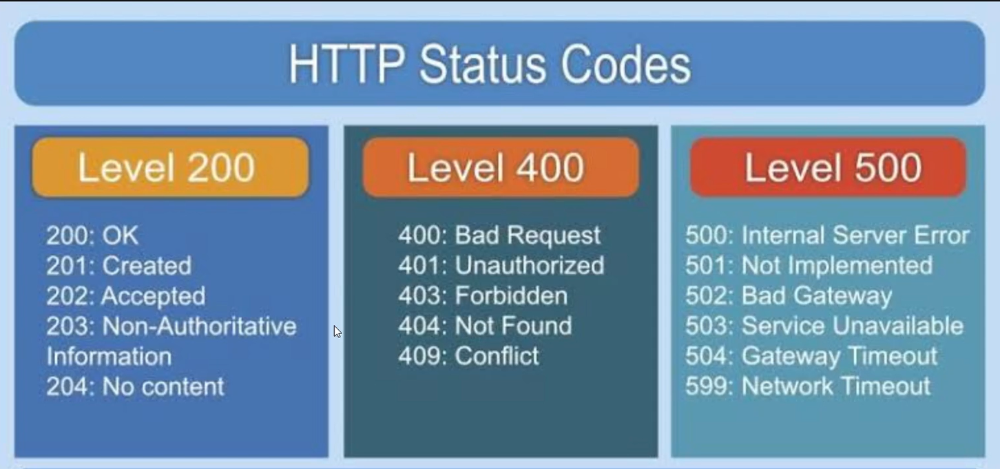

2026 sept 21 Monday

keyword
- api
- backend
- frontend
- archiechture

왜 도커를 쓰는지 
- desktop 기준: 사용이 쉬움
- 운영체제가 다름: 개발 환경과 서버 환경이 다를 수 있음
- 가상환경
- 서비스 코드를 올릴 수 있음
- 운영체제 아키텍처를 선택 가능 
- arm 14를 만들 수 있고 불러올 수 있음
- 맥이 없어도 맥의 비슷한 환경의 서비스 환경을 만들 수 있음
- 서버의 아키텍처를 불러올때 도커를 불러옴
- 성능을 선택할 수 있음
- 컨테이너
    - 공간
    - 부여할 코드들을 넣어 놓는 것

`ipconfig`
- ip 확인

파일
- 도커 컴퍼스 
    - 서비스
        - product
        - order
        - 각 기능을 분리
        - 각각 기능이 뻗었을때 서로 영향을 주지 않으려고
- Dockerfile
    - 파이썬의 어떤 라이브러리
    - 버전을 불러올 지
    - main.py
        - /health

fast
- swagger
- api정의서
    - 자동으로 백엔드 프론트 엔드의 발행 응답 형식을 만들어준다
    - 200 : 정상
    - http status codes: [외우기](https://restfulapi.net/http-status-codes/)


sequence map
- 그려놓는게 좋음
- 어떻게 데이터가 오가는지를 
- 코딩 전에 작업 필요 
- ai를 쓸꺼면 이 다이아그램을 보내주기만 해도 굿
- mermaid.ai
    - 무료
    - 시퀀스 만들어준다
    - 문법도 ai가 다 해준다
- 심화:
    - kakaodevelopfirst 가입
    - 카카오 로그인을 만들어 놓을 수 있음
        - 문서화
        - 문법: ai 시키기
        - 백엔드 올려보기를 할 수 있음
---

To be done:
- 서버에 올려보기


- admin 비번을 평민
- sql 문법상 별이 들어가는 순간 뒤에 있는 내용을 무시,
- password:`* copy`이렇게 sql에서 조회만 해도 비번이 털림

jwt debugger
- jwt.io
- 

1) docker api 생성
3) [선생님 respiratory](https://github.com/SeongminJaden/aws-fastapi-msa-lab)
---

할 일:
- api 만들어오기
---

## API란
**API**는 **Application Programming Interface**의 약자야.

아주 쉽게 말하면 **“프로그램끼리 서로 기능이나 데이터를 요청하고 주고받는 약속된 창구”**야.

예를 들어 네가 로봇 제어 프로그램을 만들었다고 해보자.

```text
[내 Python 프로그램]
       ↓ 요청
      API
       ↓
[날씨 서버]
       ↓ 응답
"현재 온도: 23°C"
```

내 프로그램이 날씨 회사의 서버 내부가 어떻게 만들어졌는지 알 필요는 없어. 그냥 그 회사가 정해둔 API 방식대로 **“성남 날씨 알려줘”**라고 요청하면 결과를 돌려주는 거야.

### 🍽️ 식당으로 비유하면

API는 **웨이터**와 비슷해.

```text
나(프로그램)
   ↓
"김치찌개 주세요"

웨이터(API)
   ↓
주방(서버)
   ↓
김치찌개 제작
   ↓
웨이터(API)
   ↓
나
```

나는 주방에 직접 들어가서 냉장고를 열거나 요리할 필요가 없지. **정해진 메뉴를 주문하면 웨이터가 주방과 연결해주는 것**처럼 API가 프로그램과 프로그램을 연결해줘.

그리고 네가 배우고 있는 **AWS / 서버 / 백엔드**랑 연결하면 더 중요해져.

```text
[앱 / 웹 / 로봇]
      ↓
     API
      ↓
[Backend Server]
      ↓
   Database
```

예를 들어 앱에서:

```text
GET /users/123
```

라고 API에 요청하면 서버가

```json
{
  "name": "Haemin",
  "age": 32
}
```

같은 데이터를 돌려줄 수 있어.

그래서 **Frontend → API → Backend → Database** 구조를 이해하면, 전에 물어본 **서버·백엔드·AWS·SDK**가 한꺼번에 연결되기 시작해.

---

### 직접 해보기

온라인 문구점에서 상품 담당 팀은 상품 이름과 가격을 관리

주문 담당 팀은 주문 정보를 관리

주문 팀은 상품 DB를 직접 읽지 않고 상품 API에 요청


