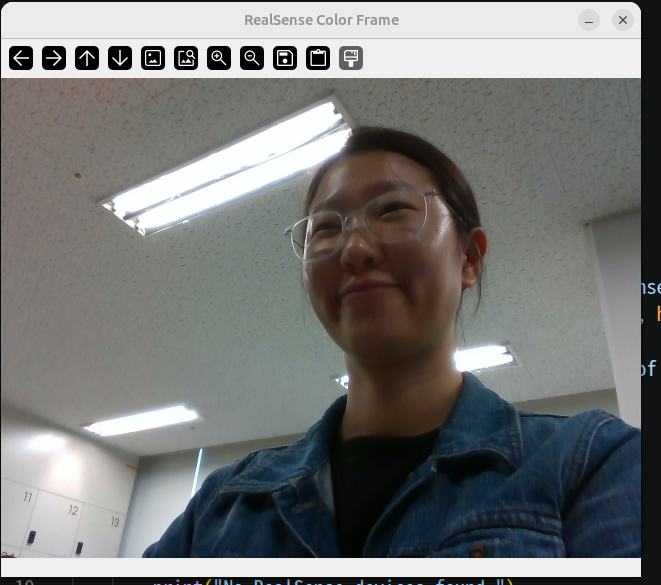

새로운 폴더를 만든다

```bash
mkdir opencv
```

python3 3.10이상인 환경에서 `opencv` 가상 환경을 만든다.

```python
python3 -m venv opencv
. opencv/bin/activate
```

 작성 test.py

```python
import argparse
import pyrealsense2 as rs
import numpy as np

def main():
    p = argparse.ArgmentParser(description="RealSense Depth Camera Example")
    p.add_argument('serial', help='Serial number of the RealSense camera')
    args = p.parse_args()
    devices = list(rs.context().query_devices())

    if not devices:
        print("No RealSense devices found.")
        return
    for d in devices:
        for key in (rs.camera_info.name, rs.camera_info.serial_number, rs.camera_info.usb_type_descriptor):
            print(f"{key}: {d.get_info(key)}")
    # device에 여러개가 인식 됨.

    if len(devices) > 1 and not args.serial:
        raise SystemExit("Multiple devices found. Please specify the serial number of the device to use.")
        # 예외차를 주는 것. 카메라에 시리얼 넘버가 부여가 안된 카메라 2개 이상을 발견했을 시

    config = rs.confic()
    #리얼 센서 인식
    #연결된 카메라를 지정한다.

    if args.serial:
        config.enable_device(args.serial)
        #해당 장비에 serial을 줄 준비가 되어있다. 
    config.enable_stream(rs.stream.depth, 640, 480, rs.format.z16, 30)
    #스트리밍을 시작                        화질                    fps
    pipeline = rs.pipeline()
    started = False
    #초기 모드

    try: 
        pipeline.start(config)
        started = True

        color = pipeline.wait_for_frames().get_color_frame()
        #serial 통신을 해서 색을 추출하는 것
        #color라는   값에 저장

        if not color:
            raise RuntimeError("Could not acqurire color frame.")

        array = np.asanyarray(color.get_data())
        print("Color frame shape: ", array.shape)

    except Exception as e:
        print("Error:", e)

    finally:
        if started:
            pipeline.stop()
            #스트리밍을 해제하고 장치를 해제한다. 

if __name__== "++main__":
    main()

```

python run

```bash
python test.py
```

결과

```bash
camera_info.name: RealSense D435
camera_info.serial_number: 261822078400
camera_info.usb_type_descriptor: 2.1
Error: Frame didn't arrive within 5000
```

에러 원인:

usb가 연결이 안되어 있었음

정상 결과

```bash
camera_info.name: RealSense D435
camera_info.serial_number: 261822078400
camera_info.usb_type_descriptor: 3.2
Color frame shape:  (480, 640, 3)
```

사진을 프레임당 저장하는 코드로 전환해서 새로운 창에 그림을 반영하도록 하는 코드로 실행하면

```bash
import argparse
import cv2
import numpy as np
import pyrealsense2 as rs

def main():
    parser = argparse.ArgumentParser(description="RealSense Camera Example")
    parser.add_argument("--width", type=int, default=640, help="Width of the image")
    parser.add_argument(
        "-s", "--serial", type=str, help="Serial number of the RealSense device"
    )
    args = parser.parse_args()

    context = rs.context()
    devices = list(context.query_devices())

    if not devices:
        print("No RealSense devices found.")
        return

    if len(devices) > 1 and not args.serial:
        print("Multiple RealSense devices found. Please connect only one device.")
        for device in devices:
            print(f"Device: {device.get_info(rs.camera_info.name)}, Serial: {device.get_info(rs.camera_info.serial_number)}")
        return

    config = rs.config()
    if args.serial:
        config.enable_device(args.serial)
    config.enable_stream(rs.stream.color, args.width, 480, rs.format.bgr8, 30)

    pipeline = rs.pipeline()
    started = False

    try:
        pipeline.start(config)
        started = True
        print("Pipeline started successfully.")

        while True:
            frames = pipeline.wait_for_frames()
            color_frame = frames.get_color_frame()

            if not color_frame:
                continue

            frame = np.asanyarray(color_frame.get_data())
            cv2.imshow("RealSense Color Frame", frame)

            if cv2.waitKey(1) & 0xFF == ord('q'):
                break

    except Exception as e:
        print(f"An error occurred: {e}")
    finally:
        if started:
            pipeline.stop()
        cv2.destroyAllWindows()

if __name__ == "__main__":
    main()
```

성공 


