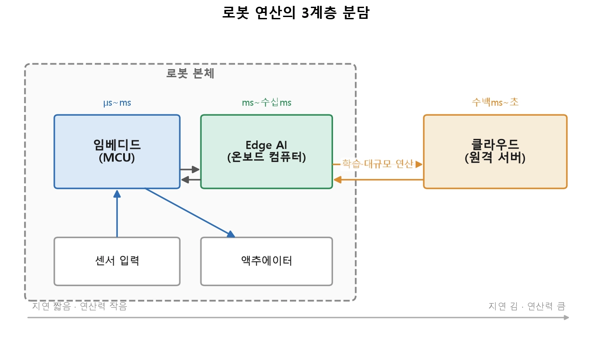
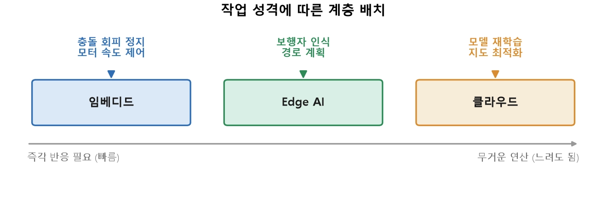
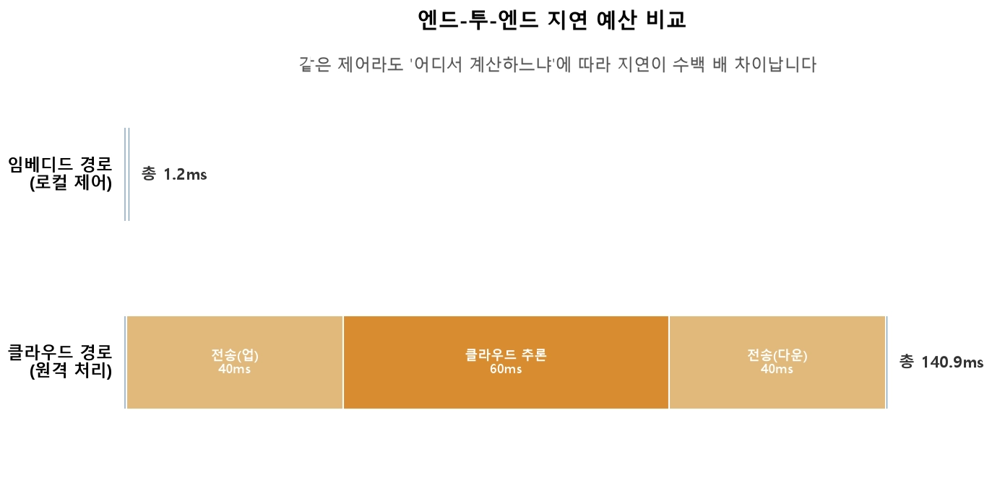

Ubuntu 설치 방법
<br> https://teamsparta.notion.site/Ubuntu-22-04-Rufus-USB-3ae2dc3ef514814e813dc5d6aa10a4e0

Physical Ai란
<br> https://teamsparta.notion.site/1-Physical-AI-3ae2dc3ef51481c48b86e9522bb02fa2

**Physical Ai**: 인지(percieve), 판단(decide), 행동(act) 하는 인공지능
- 센서로 세상을 읽고 모터로 세상에 힘을 가함.

<br>

|구분| 소프트웨어 Ai (예: 챗봇)| Physical Ai: (로봇)|
|----|----|----|
|입력|텍스트/이미지(디지털)|센서 신호(물리량)|
|출력|텍스트/이미지(디지털)|모터 구동 (물리적 힘)|
|시간 제약|수 초 지연 허용|밀리초 단위 마감 존재|
|실패의 결과|잘못된 답변|충돌/낙하/사고|
|실행 환경|대형 GPU 서버| 제한된 온보드 컴퓨터|

<br>

## Ai의 제약, 그에 따른 Physical Ai의 계층 계산

### 소프트웨어 Ai의 제약

**실시간성** - 물리적으로 로봇이 넘어주는 중에 계산이 이루어지면 늦음. 물리학적 사고 시간과 계산 시간이 비례되지 않음
<br> **안전성** - 안전을 담당하는 계층은 빠르게 처리되어 사고를 예방해야 함. 잘못된 출력 방지. 
<br> **자원 제약** - 로봇에 탑재된 컴퓨터에는 데이터센터의 GPU서버만큼 강력하지 않음. 전력/발열/무게 제약을 받음

<br>

### Physical Ai의 차이

**계층 연산**
<br> 임베디드 / Edge Ai/ 클라우드

연산과 반응의 속도 허용 범위에 따라 연산 계층을 분담한다. 




센서에 가까울술록 빠르게 - **임베디드**
<br> 연산이 무거울수록 멀리 - **클라우드**

#### 안쪽으로 갈수록 지연이 짧고, 바깥으로 갈수록 연산 능력이 큼

|계층|대표 하드웨어|담당 작업|지연|특징|
|---|---|---|---|---|
|임베디드|MCU (STM32, Cortex-M)|모터 제어 루프, 센서 읽기, 안전 정지(E-stop)|μs~ms|초저지 연/초저전력,RTOS/베어케탈,연산력 작음|
|Edge Ai| Jetson Orin, 온보드 x86 PC| 객체 인식, 센서 융합, 지역 경로 계획, SLAM|ms~10ms|GPU/NPU로 실시간 Ai추론, 리눅스 +ROS2|
|클라우드|GPU 서버 클러스터|모델 학습, 대규모 지도 생성, 원격 모니터링/업데이트|100ms~1s|연산력 최대, 네트워크 의존, 비상시 불각용|

필요한 반응 속도에 따라 연산 계층을 선택한다. 


**임베디드** - 넘어짐 방지, 충돌 회피 (*즉각 반응*)
<br> **Edge Ai** - 카메라로 사람을 인식하는 것처럼 (*실시간 Ai 추론*)
<br> **클라우드** - 수집한 데이터로 급하지 않은 (*모델 재학습*)



<br>

## 판단의 핵심 
각 계층에 어떤 연산 단계를 심을지 판단하기 위해서는 사전에 컴퓨터 전선 계산의 무게를 두고 판단 기준을 세워 차례대로 지정 위치를 정한다.  

### 1. 지연 예산 (latency budget)
**지연 예산** - 최대 허용 지연 시간.

지연되는 시간을 예상하여 어느 계층에 해당 연산 범위를 기입할지 판단해야 함. 





|계층|프로세스|총 시간|
|---|---|---|
|임베디드 처리| 센서 0.5ms + 계산0.3ms + 출력0.4ms|~1.2ms|
|클라우드 왕복| 왕복 전송80ms + 추론60ms|~140ms

보이는 바와 같이 임베디드 경로는 총 1.2ms 가 허용 범위이고 이에 클라우드 작업은 100배 이상에 달하여 **임베디드 연산 과정에서 제외한다**. 

<br>

### 2. 데이터 전송량과 대역폭
사진/비디오 같은 고함량의 데이타를 클라우드로 왕복 이동하기에는 비현실적임. 

```
1080p 30fps 컬러 영상(무압축): ~1920x1080x3bytex30 ~ 187MB/s
3D LiDAR: 100,000~1,000,000pts per second
```

<br> 네트워크 대역폭이 부족. 
<br> 높은 비용. 


해결 방법:

```
데이터는 발생한 곳 근처에서 처리하고
결과(요약)만 상위 계층으로 보낸다. 
```

<br>


## 전부 클라우드에 두지 않는 이유

**지연** - 네트워크 데이터 왕복 이동성이 (10~100ms) 실시간 제어에 치명적
<br> **대역폭** - 원시 센서 데이터를 전부 올리기엔 통신량이 너무 큼
<br> **가용성** - 통신이 끊기면 클라우드 의존 로봇은 멈춤. 안전 장치는 통신과 무관하게 작동해야 함. 
<br> **프라이버시** - 가정/병원의 정보 유출은 정보 보완에 문제가 되고, 전송/연산 비용도 듬. 

 ### ROBOTICS
**연산 offloading** - 원격과 로컬에 맡길 연산을 동적으로 정하는 기법
- offloading 결정을 위한 고려 부분:
    - 현재 네트워크 상태(대역폭/지연)
    - Edge의 남은 연산 여유와 배터리
    - 작업의 지연 예산
    <br> !! 계층 배치는 고정값이 아니라 런타임 상황에 따라 결정될 수 있음

<br> **모델 분할** - 신경망의 앞부분(특징 추출)은 Edge에서 처리해 데이터를 압축한 뒤, 뒷부분(무거운 분류)만 클라우드로 보낸다


## EXAMPLE
자율주행 in 골목
- **임베디드**: 바퀴 모터 속도를 목표값에 맞추고 (1kHz 제어 루프), 범퍼 센서가 눌리면 통신 상태와 무관하게 즉시 정시
- **Edge Ai**: 전방 카메라/LiDAR를 융합해 보행자/장애물을 인식하고, 다음 몇초의 지역 경로를 계획합니다.(수십 Hz). 원시 영상은 여기서 소비하고 "장애물 위치" 같은 요약만 남깁니다. 
- **클라우드**: 로봇이 하루 동안 다닌 경로/이벤트 데이터를 모아, 밤사이 배달 경로 최적화 모델을 재학습하고 다음 날 로봇들에 배포합니다. 