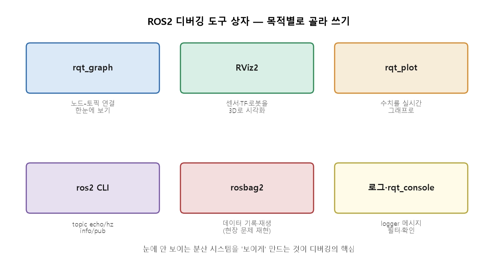
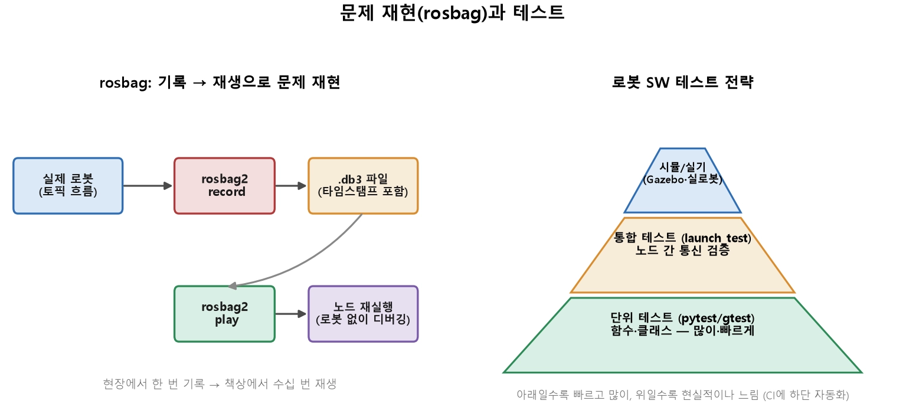

date:2026 Aug 14, Friday


## 1. 디버깅 도구 상자 - 목적별로 고르기
문제 구별에 따라 디버깅 진단 도구



<br>

토픽 존재·내용·주파수·QoS
```bash
$ ros2 topic list / echo / hz / info 
```
<br>

노드와 그 연결
```bash
$ ros2 node list / info                 
```
<br>

직접 메시지 주입해 테스트
```bash
$ ros2 topic pub ... 
```
<br>

노드-토픽 연결 시각화
```bash
$ rqt_graph                             
```
<br>

"무엇이 궁금한가"에 따라 도구를 고르는 것이 **Debugging** 입니다. 

<br>

## 2. Rviz2 - 로봇의 눈으로 3D 보기
RVIZ2 - ROS2의 대표 3D 시각화 도구. 추상적인 숫자 토픽을 공간 속 형상으로 표현.여러 정보를 하나의 공간에 겹쳐 볼 수 있는 강력한 도구.

- 센서데이터: LiDAR 점군, 카메라 영상, 깊이 데이터를 3D 공간에 표시
- TF 좌표계: frame tree를 3D 축으로 - 각 좌표계가 로봇과 함께 움직이는 것을 시각화
- 로봇 모델: 로봇의 형상(URDF)을 실제 자세로 렌더링
- 경로·마커: 계획된 경로, 감지된 장애물을 시각적으로


<br>

1. RViz 먼저 실행
```bash
$ rviz2
```
 <br>

2. Gazebo 실행
```bash
$ ros2 launch turtlebot3_bringup rviz2.launch.py
```

 <br>

3. turtlebot 실행
```bash
$ ros2 launch turtlebot3_gazebo turtlebot3_world.launch.py
```
or (위 코드가 안돼면)
```bash
$ ros2 launch turtlebot3_gazebo empty_world.launch.py
```

 <br>
 
4. 입력 키창 띄우기
```bash
$ ros2 run turtlebot3_teleop teleop_keyboard
```
- 입력해보기

창이 띄워지면 몇가지 옵션을 바꿔서 볼 수 있는 시점들 알맞게 고르기

- Fixed Frame : base_footprint
    - map에서 base_footprint로 전환 후 enter
    - 인식이 되는 옵션을 선택해야 확인 가능
- Add -> Pose : /goal_pose 
    - 알맞는 Topic을 선택해야 볼 수 있음. 
- Marker.SPHERE_LIST or MarkerArray - 여러 점을 한번에 그리고싶을 때


!! ***빨간 표시가 뜨면 알만는 옵션을 재선택해서 확인해보기*** !!


### 내 계산한 결과 보기
RViz2는 Topic에 있는 것만 그린다.
<br> "내가 계산한 결과"를 보려면 그것을 Marker Topic으로 발행해야 함. 
<br> 표준 타입 - 'visualization_msgs/Marker'

```python
from visualization_msgs.msg import Marker

m = Marker()
m.header.frame_id = 'world'                      # 어느 좌표계 기준인가(14강)
m.header.stamp = self.get_clock().now().to_msg()
m.ns, m.id = 'waypoints', 0                      # 같은 ns+id 는 덮어쓰기, 다르면 따로 그림
m.type = Marker.SPHERE                           # SPHERE·CUBE·ARROW·LINE_STRIP·TEXT_VIEW_FACING
m.action = Marker.ADD
m.pose.position.x, m.pose.position.y = 2.0, 3.0
m.pose.orientation.w = 1.0                       # 회전 없음
m.scale.x = m.scale.y = m.scale.z = 0.2          # 크기 [m] — 0 이면 안 보인다
m.color.r, m.color.a = 1.0, 1.0                  # a(알파) 0 이면 투명해서 안 보인다
self.marker_pub.publish(m)
```
<br>

### Robotics
- Marker 메세지에 계산 결과를 담아 Topic으로 발행하고, RViz2 에서 그 토픽을 추가하면 화면에 뜹니다.  
- 여러 정보를 하나의 공간에 겹쳐 볼 수 있는 강력한 도구
- "LiDAR가 본 장애물" & "인지가 검출한 장애물" & "TF상 센서 위치"를 한 화면에 겹쳐보고 좌표 일치성을 확인한다. 
- TF debugging에서 RViz2는 필수.

### 문제 
위와 같은 절차를 진행해도 화면에 아무 것도 안나온다면 원인은 대개
<br> **scale 0 · alpha 0 (color.a = 0) · Fixed Frame** 불일치 셋 중에 하나입니다. 

<br>

## 3. rosbag2 - 기록하고 재생하기
디버깅의 어려움인 재현을 기록하고 재생해보는 과정
- timestamp
- replay



1. 녹화를 시작해본다.
```bash
$ ros2 bag record /scan /image /tf     # 지정 토픽 기록(-a는 전체)
```
녹화 중인 터미널에서:

• Space : 일시정지(Pause).
<br> • Space 다시 : 녹화 재개(Resume).
<br> • Ctrl+C : 녹화 종료 및 bag 저장 완료.

2. 전체를 이름붙여 기록한다
```bash
$ ros2 bag record -a -o field_test_01
```
<br>

3. 재생
```bash
$ ros2 bag play field_test_01   
```
<br>

4. 내용 요약
```bash
$ ros2 bag info field_test_01           # 토픽/기간/메세지 수
```


### Robotics 
**data set 구축** - Ai 학습용 로봇 데이터
<br> **호귀 테스트** - 같은 입력에 알고리즘이 여전히 잘 작동하는지 확인하는데 사용

<br>

***"현장에서 한번 기록, 책상에서 무한 재생"***

<br>

## 4. 예외 처리와 로깅 - 노드가 죽지 않게

- 예외 처리 of 콜백
    - 콜백 안에서 예외가 새어 나가면 executor가 그 노드를 멈춰 세움
    - 그래서, 콜백은 실패할 수 있는 계산만, 코드만 try로 감싼다 
    
<br>

-  로그 레벨
    - 알고 있는 정보 예외는 경고 로그와 함께 주기를 건너뜀
    - 상태 바뀌는 순간만 info
    - 반복되는 이상은 warn
    - 노트북 코드가 죽으면 셀에 빨간 글자만 표기
    - 노드가 죽으면 로봇이 마지막 명령 상태로 남음

<br>


### How to 


<br>

예시
```python
def on_scan(self, msg):
    try:
        d = self.nearest(msg)                         # 실패할 수 있는 계산
    except (ValueError, ZeroDivisionError):           # 대응 방법을 아는 예외만
        self.get_logger().warn('스캔 한 프레임 건너뜀')   # 다음 주기에 다시 시도
        return
    self.publish(d)
```

<br>

- **좁게 잡는다**: ```except Exception``` 으로 뭉뚱그리면 내가 만든 버그 (```NameError``` 등)까지 삼켜 원인을 못 찾음
- **복구 불가한 실패는 살려두지 않음**: 모터 통신이 끊겨 상태를 모르는 채 명령을 계속 내리는 것이 멈춘 로봇보다 위험함. 정지 명령을 보낸 뒤 종료합니다. 
- **종료 경로를 만든다**: ```finally``` 또는 ```destroy_node()``` 직전에 정지 명령과 포트 정리를 넣어 Ctrl + C 로도 안전하게 내려오게 합니다. 


***node logger*** - ```print``` 대신 이 명령으로 level이 ```rqt_console```(1절)에서 필터링 되고, 어느 노드에서 나온 로그인지 기록됩니다. 

|레벨|언제|로봇 예|
|---|---|---|
|debug|개발 중 상세 추적|매 주기 중간 값|
|info |상태가 **바뀌는 순간**| "라이다 연결됨", "목표 도달"|
|warn|이상하지만 계속 가능|"스캔 3개 누락"
|error|기능 하나가 실패|"지도 저장 실패"|
|fatal|계속할 수 없음|"모터 통신 단절 -- 정지"|


## 5. TEST - 문제가 생기긱 전에 잡기
**debug** - 터진 곳을 고치는 것. 물리적인 사고.
<br> ***TEST*** - 터지지 않게 막는 것. 핵심적인 문제 해결.


|피라미드 구분|실행력|구분|
|-----|-----|-----|
|꼭대기|용량 적게/ 느림| 시뮬레이션/ 실기 (Gazebo·실로봇)|
|중간|  |통합 테스트 (launch test) 노드 간 통신 검증|
|맨 아래|용량 많이/빠름|단위 테스트(함수·클래스)|


--> !!!**순서**!!! - 아래서 위 순서로 추천

<br>

## 단위 테스트 - pytest(Python)
순수 로직은 ROS2 없이도 테스트 가능

<br>

코드 설계:
```python
# test_safety.py

from robot_utils.safety import compute_stop_distance

def test_stop_distance_zero_speed():
    assert compute_stop_distance(0,0) == 0.0

def test_stop_distance_increases_with_speed():
    assert compute_stop_distance(2.0) > compute_stop_distance(1.0)

def test_stop_distance_formula():
    # v=1.0, decel=1.5 -> 1.0/(2*1.5)
    assert abs(compute_stop_distance(1.0) - 1/3) < 1e-6
```

<br>

실행창:
```python
pytest test safety.py -v
```

<br>
확인할 내용:

- 경계값 - (0,음수, 최대)
- 불변식 - (속도가 크면 정지거리도 크다)

***제어·안전 로직**처럼 '*물리와 직결된 함수*' 일수록 촘촘히 테스트 한다.

<br>

## 단위 테스트 - gtest (C++)

C++은 gtest를 사용. 구조는 동일.

```cpp
#include <gtest/gtest.h>
#include "robot_utils/safety.hpp"

TEST(SafetyTest, ZeroSpeed) {
    EXPECT_DOUBLE_EQ(comuteStopDistance(0,0), 0.0);
}
TEST(SafetyTest, IncreasesWithSpeed) {
    EXPECT_GT(computeStopDistance(2.0), computeStopDistance(1.0));
}
```

<br>

## CI와의 연결

pytest & gtest를 CI(GitHub Actions)에 넣으면 Pull request (PR)마다 자동으로 실행 됨. 

"안전 로직을 건드린 PR이 테스트를 깨면 병합 불가" - 물리적 사고로 이어질 회귀를 코드 단계에서 차단.

<br>

## ROBOTICS
통합 테스트 & Simulation 기반 검증 순서

1. ```단위 테스트: pytest & gtest```는 **함수를 검증**하지만
<br> *BUT*
<br> "node A가 발행한 것을 node B가 제대로 받아 처리 하는가" 같은 **상호작용**은 못 잡습니다. 

2. ROS2는 ```launch_test```로 여러 노드를 띄우고 토픽 흐름을 검증하는 **통합 테스트**를 지원합니다. 

2. ```Simulation Test``` - 
- Gazebo에서 가상 로봇을 띄워 
<br> "장애물 앞에서 실제로 멈추는가"를 **하드웨어 없이 확인**한다. 
- rosbag 재생과 결합하여 
<br> "현장 데이터로 알고리즘 회귀 테스트" 까지 **자동화**할 수 있음.

<br>

## 문제
#### "빠른 단위 테스트는 두껍게, 느린 실기 테스트를 얇게"
모든 것을 실로봇으로 확인하려 하면 개발이 멈추고, 모든 것을 단위 테스트로만 하면 통합 문제를 놓칩니다. 계층을 나누는 것이 "빠른 것과 느린 것의 분리"와 같은 사고다. 


