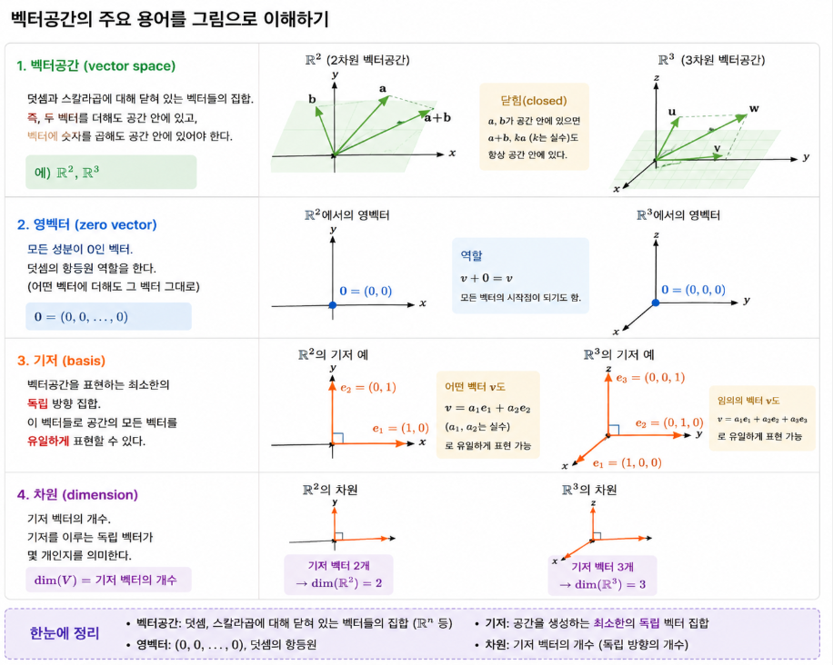
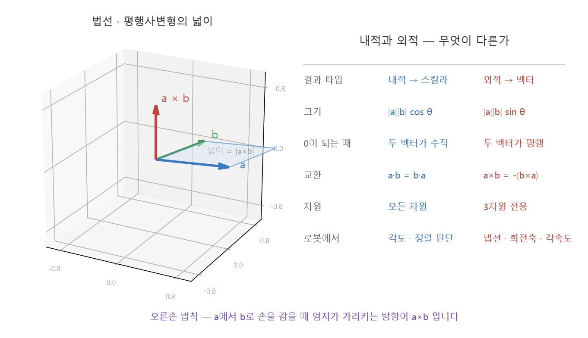
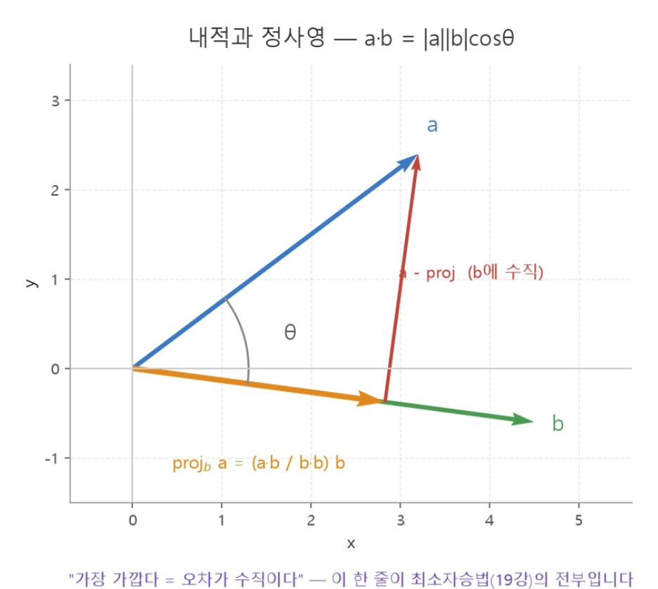
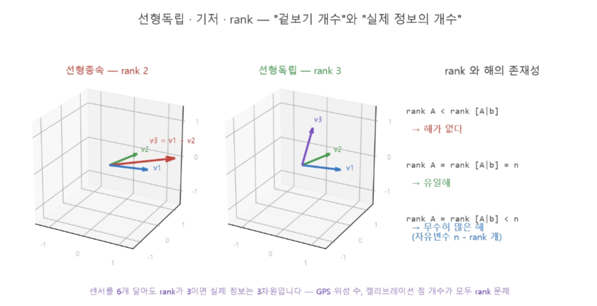

date: 2026 Aug 18, Modday

# 로봇공학을 위한 고등학교 수학

교제 링크
<br> https://teamsparta.notion.site/17-3ae2dc3ef51481ae9f19e396c3a1be01

TF2 Library 사용 예정
- 모든 것을 원점 기준으로 알려준다

## 백터-행렬 연산과 내적-외적

#### Good to know!
- numpy에서는 벡터 행렬이 성립되지 않으면 바로 오류가 뜬다

### 벡터에 관하여



#### 벡터가 되려면:
크기, 방향, 교환법칙

```math
\mathbf{a} + \mathbf{b} = \mathbf{a} + \mathbf{b}
```
를 포함한 연산 법칙을 충족해야  함.


---
### ROBOTICS
**기저**: 로봇의 base 좌표계/ 카메라 좌표계/ LiDAR 좌표계
<br> **"좌표 변환"**: 한 기저의 기준에서 다른 기저의 기준으로 전환
<br> **TF2**가 해당 좌표 변환 담당을 하는 모듈.

---

### 행렬

**행렬(matrix)** = 수직을 직사각형으로 배열한 것.
<br> *"행 x 열"* = 행렬-벡터. 곱은 열의 선형결합.

설명:
<br> Ax를 "A의 열들을 x의 성분만큼 섞은 것" 즉,
<br> AB는 "B를 먼저 적용하고 A를 적용하는 합성 변환"
<br> 즉, ***결합법칙***을 성립:

```math
\mathbf{A}\mathbf{B}x = \mathbf{A}(\mathbf{B}x)
```
<br> ***분배법칙***도 성립 가능:

```math
\mathbf{A}(\mathbf{B}+\mathbf{C}) = \mathbf{A}\mathbf{B}+\mathbf{A}\mathbf{C}
```

<br>

다만, ***교환법칙***은 성립이 안됨:

```math
\mathbf{A}\mathbf{B} \not= \mathbf{B}\mathbf{A}
```

<br>

---

### ROBOTICS

회전행렬의 열이 "회전된 좌표축"인 것을 발견할 수 있음


---

<br>


## 특별한 행렬들
- 단위행렬, 전치행렬, 대칭행렬, 반대칭행렬
- 정방행렬 = 대칭 + 반대칭

**Tip!** - "어떤 행렬"인지 먼저 구분하기

<br>

#### 단위행렬 I
```math
\mathbf{A}\mathbf{I} = \mathbf{I}\mathbf{A} = \mathbf{A}
```
- 대각 1, 나머지 0
- 아무것도 하지 않는 변환

<br>

#### 전치행렬 A^T
```math
(\mathbf{A}\mathbf{B})^T = \mathbf{B}^T\mathbf{A}^T
```
- 행과 열을 맞바꿈
- 순서가 뒤집히는데 주의


<br>

#### 대칭행렬 A=A^T
```math
\mathbf{A} = \mathbf{A}^T
```
- 관성 텐서, 강성행렬, 공분산 행렬
- 고유값이 항상 실수 

<br>

#### 반대칭 A = -A^T

```math
\mathbf{A} = -\mathbf{A}^T
```
- 대각 성분이 0
- 외적*각속도의 형태
- 3D 회전의 미분 구조

<br>

#### 정방행렬 = 대칭 + 반대칭

```math

A = \underbrace{\tfrac{1}{2}(A + A^{\top})}_{\text{대칭}} + \underbrace{\tfrac{1}{2}(A - A^{\top})}_{\text{반대칭}}
```

---


### 외적
- 외적(cross product)
- 반대칭행렬의 곱
- 3차원의
- 결과는 **벡터**
- 로봇 각속도의 뿌리


<br>

1. a의 반대칭행렬을 곱한 것:
```math
a \times b --같은 계산--> [a]_\times b
```

<br>

즉:
```math
[\mathbf{a}]x = \begin{bmatrix} 0,-a_3,a_2\\ a_3,0,-a_1 \\ -a_2, a_1, 0 \end{bmatrix}
```

---

### ROBOTICS

**로봇공학**의 핵심 관계식:

- 회전행렬의 미분 = 강체의 각속도 ω 곱하기 회전행렬
```math
\dot{R}=\frac{dR}{dt} = [\omega]_\times\mathbf{R}
```

---

2. **법선과 회전축**

```math
\mathbf{a}\times\mathbf{b}=\begin{bmatrix}a_yb_z-a_zb_y \\ a_zb_x-a_xb_z \\ a_xb_y-a_yb_x\end{bmatrix}, |\mathbf{a\times b}|=|\mathbf{a}||\mathbf{b}|\sin\theta
```


- 법선: 외적 a x bsms 두 벡터가 이루는 평면에 수직인 벡터
- 크기: 두 벡터가 만드는 평행사변형의 넓이
- 오른손 법칙: a와 b를 감싸고 나오는 엄지 손가락의 방향이 외적 방향


---

### ROBOTICS

로봇에서의 외적 쓰임:

***평면의 법선*** - 바닥·테이블 위 세점으로 이루어진 평면의 수직 방향
- 비전·포인트클라우드의 핵심 모듈

***회전축*** - 두 자세 사이의 회전축이 외적으로 계산됨
<br> ***좌표축*** - 두 방향 + 세 번째 축을 외적으로 만들어 직교 좌표계 완성
<br> ***넓이·방향 판정*** - 세 점이 이루는 삼각형의 넓이, 점이 선의 어느 쪽에 있는지


스칼라 - 각도, 투영
<br> 벡터 - 수직 방향, 넓이

---

<br>

### 내적
inner product, dot product
<br> #scalar

```math
\mathbf{a} \cdot \mathbf{b} = a_x b_x + a_y b_y + a_z b_z = |\mathbf{a}|\,|\mathbf{b}|\cos\theta
```

숫자의 곱 = 크기,각도로 표현한 기하학적 정의




### EXAMPLES
1.) 두 벡터 사이 내적과 각도를 구하시오
<br> a = (1,2,2) <br> b = (2,0,1)

내적을 구하는 공식:
```math
\mathbf{a} \cdot \mathbf{b} = a_x b_x + a_y b_y + a_z b_z 
\\\mathbf{a} \cdot \mathbf{b} = 1\cdot2 + 2\cdot0 + 2\cdot1
\\= 2+0+2
\\= 4
```

<br>

각도를 구하는 공식:
```math
\mathbf{a} \cdot \mathbf{b} = a_x b_x + a_y b_y + a_z b_z = |\mathbf{a}|\,|\mathbf{b}|\cos\theta
\\|\mathbf{a}|\ =  \sqrt{a_x^2 + a_y^2 + a_z^2}   
\\|\mathbf{a}|\ =  \sqrt{1^2 + 2^2 + 2^2}
\\|\mathbf{a}|\ = 3
\\|\mathbf{b}|\ =  \sqrt{b_x^2 + b_y^2 + b_z^2}
\\|\mathbf{b}|\ =  \sqrt{2^2 + 0^2 + 1^2}
\\|\mathbf{b}|\ = \sqrt{5} 
\\4 = |\mathbf{a}|\,|\mathbf{b}|\cos\theta
\\4 = 3 \cdot\sqrt{5}\cos\theta
\\\theta = \arccos(\frac{4}{3\cdot\sqrt{5}})
\\\theta = 53.4\degree
```

#### 내적 = 4
#### 각도 = 53.4°

2.) 내적과 외적이 각 0이 되는 순간의 예시

**내적** = 0 일땐, 각도가 90°일 때다
즉, 두 벡터가 서로 **수직(직교)**일 때

```math
\mathbf{a}\cdot\mathbf{b} = |\mathbf{a}||\mathbf{b}|\cos\theta
\\\mathbf{a}\cdot\mathbf{b} = 0
\\ 0 = |\mathbf{a}||\mathbf{b}|\cos\theta
\\ 0 = \cos\theta
\\\space
\\ \theta = 90\degree
```

<br>

**외적** = (0,0,0) 일땐, 각도가 0° or 180° 때
<br> 즉, 두 벡터각 서로 **평행**일때. 같은 방향 or 반대방향. 

```math
|\mathbf{a \times b}| = |\mathbf{a}||\mathbf{b}|\sin\theta
\\ 0 = |\mathbf{a}||\mathbf{b}|\sin\theta
\\ 0 = \sin\theta
\\\space
\\ \theta = 0\degree \text{or }  180\degree
```

## 선형독립·기저·차원과 rank
**선형독립 & rank** - '겉보기 개수' vs '실제 독립 정보의 개수'를 구분하는 개념

<br>

**선형종속** - 한 벡터로 중복되는 벡터
```
--------->--------->
         v1        v2
```
```math
c_1v_1+c_2v_2+\cdots+=0
```
여러 벡터 중에 같은 정보를 준다면 

예를 들어 

```math
v_1 = \begin{bmatrix}1 \\ 2\end{bmatrix}, \qquad  v_2 = \begin{bmatrix}1 \\ 2\end{bmatrix}
\\\space
```
잘 보면 그저 2배수나 한 같은 벡터일 뿐이다. 
```math
\\ v_2=2v_1
```

<br>

그러나 

<br>

**선형독립** - v1을 아무리 몇 배 해도 v2를 만들 수 없을 때:
```
       v₂
       ↑
       |
       |
───────●──────→ v₁

```

아래와 같은 벡터들의 조합이
```math
c_1v_1+c_2v_2+\cdots+=0
```

<br>

결국 배수는 '0'이라는 의미를 같게 됨.
```math
c1=\cdots=c_k=0
```

<br>

c 가 0 이 아니면 = **선형종속**,
<br> c 가 0 이면 = **선형독립**

<br>



### 해석


