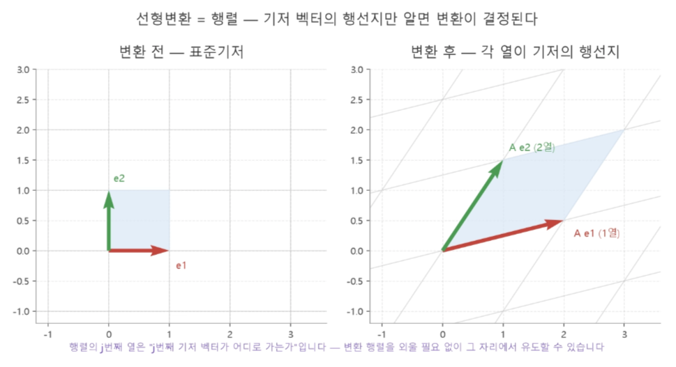
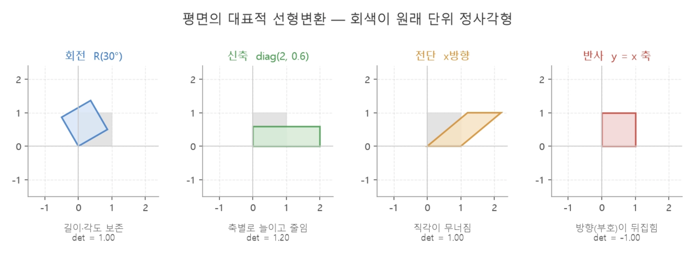
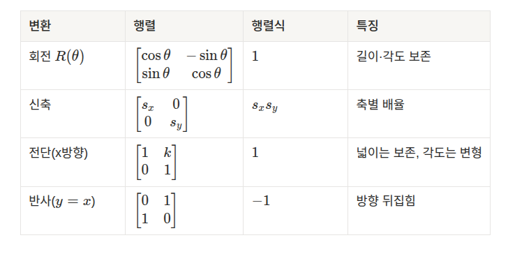
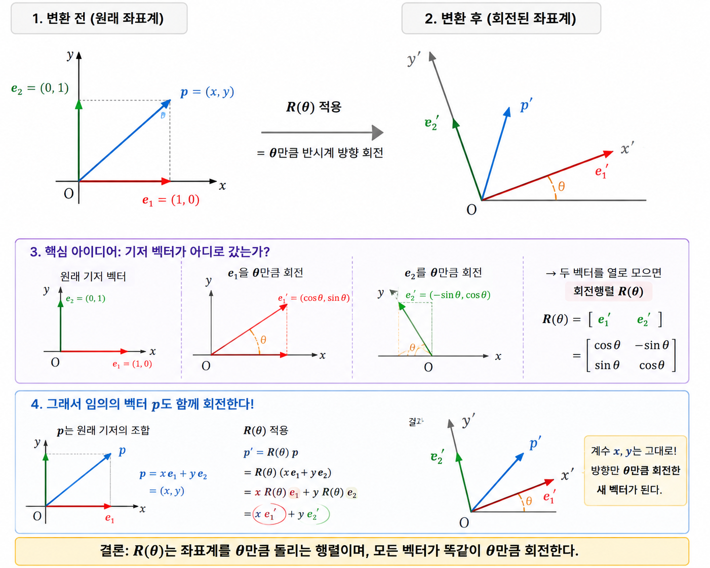

date: 2026 Aug 19, Wednesday

# 회전행렬 2D -> 3D, 오일러 각과 짐벌락


적용: 로봇의 smooth한 회전 이동을 위한 수학 공식


## 선형변환 = 행렬
<br>


원점을 지나는 직선
```math
y = ax
\\ f(x) = ax : \qquad f(0) = 0
```

두가지 성질을 지닌다
<br> 차원 1, 차원 2
<br> 이 두가지 성질(선형성)을 여러 차원으로 확작한 것이 **선형변환**
```math
\\ f(x+y) = f(x) + f(y) \qquad f(kx) = k f(x)
```

**선형결합** = 벡터들을 가지고 새로운 벡터를 만드는 방법

예)

```math
e_1 = \begin{bmatrix}1 \\ 0 \end{bmatrix}, \qquad e_1 = \begin{bmatrix}0 \\ 1 \end{bmatrix}
```

그래프:
```
  e_2
  ^
  |
  |
  .______-> e_1
```

2차원 벡터는 또다른 2차원 벡터를 섞어서 새로운 벡터를 생성
```math
 x = \begin{bmatrix}3 \\ 2\end{bmatrix} \space -> \space x = 3e_1 + 2e_2
```
즉 e1을 3배, e2를 2배.

---


<br> **선형변환** = 만들어진 벡터를 일정한 규칙으로 다른 벡터로 바꾸는 방법

T = transformation, 변환 규칙

T(x) 는: T라는 규칙으로 x를 변환시킨 결과

그래서 아까 있었던 선형결합을 생각했을 때 적용 시키면:

```math
T(x) = T(3e_1 + 2e_2)
```

---

**선형변환**은 **선형결합**을 보존한다. 즉
<br> 더하기와 배수를 그대로 보존한다. 

```math
T(3e_1 + 2e_2) \qquad -> \qquad 3T(e_1) + 2T(e_2)
```

해서 공시을 공용화 한 버전:

```math
T(x)=x_1T(e_1)+x_2T(e_2)
```


---

여기서 ```x```는 동일하게 적용한다는 것을 인지 했을 때 두가지만 알면 된다:

```math
\boxed{T(e_1)}
\\ \space
\\ \boxed{T(e_2)}
```
x의 기본축 e1, y의 기본축 e2만 알면 된다. 

원래 그래프를 

          e₂
          ↑
          │
          ●──────→ e₁
에서

이 그래프로 변환 했다면

     T(e₂)
       ↖
        \
         ●
          \
           ↘ T(e₁)

<br>

모든 벡터가 아래 공식으로 이루어졌기 때문에
```math
x = x_1e_1 + x_2e_2
```
컴퓨터는 두벡터만 알아도 다른 모든 벡터가 어디로 가는지 계산할 수 있다. 

---

그래서 결정한 것이 두 벡터를 나란히 놓기로 하는데 

```math
A = [T(e_1) \space T(e_2)]
```
T(e1)은 열1, T(e2)는 열2로 배치되면서

```
열 = 기저 벡터의 행선지
```
라고 불리우게 됨. 


해서 아래 그림처럼 원래의 벡터가 어떤 A나 T로 인해 벡터의 방향이 변형 되었는지 
<br> 또는 모양이 바뀌게 되었는지 알 수 있다. 



<br>

기존의 회색갈 면적이 원래의 모양이었다면,
<br> det = 행렬식(determinant) 에 따라 
회전, 신축, 전단 x방향, 반사의 모양으로 변형 되었는지 알 수 있다. 



아래 테이블이 각 변형이 일어났을때 나타날 행렬의 형태를 묘사한다. 



## ROBOTICS

이걸 로봇의 회전행렬까지 연결 하면 

```math
R = \begin{bmatrix} | \qquad| \qquad | \\ Re_1 \quad Re_2 \quad Re_3 \\ | \qquad | \qquad | \end{bmatrix}
```
로봇에 붙어 있는 모든 점의 방향과 위치가 회전에 의해 어떻게 바뀌는지 계산할 수 있음. 

```math
\boxed{기저벡터} \rightarrow \boxed{선형결합} \rightarrow \boxed{선형변환} \rightarrow \boxed{행렬} \rightarrow \boxed{회전행렬} \rightarrow \boxed{로봇 좌표변환}
```

<br>

## 2D 회전행렬

회전행렬을 직접 유도하는 방법.

각도 $\theta$ 만큼의 반시계 회전은

$e_1 = (1,0)$ 을 $(\cos\theta, \sin\theta)$로,
$e_2 = (0,1)$ 을 $(-\sin\theta, \cos\theta)$로 전환한다. 

이 둘을 열로 세우면:


```math
\begin{bmatrix}x' \\ y'\end{bmatrix} = \begin{bmatrix}\cos\theta \quad -\sin\theta \\ \sin\theta \qquad \cos\theta\end{bmatrix} \begin{bmatrix}x \\ y\end{bmatrix} = R(\theta)\begin{bmatrix}x \\ y\end{bmatrix} 
```

첫번째 열 $(\cos\theta,\sin\theta)$
<br> 두번째 열 $(-\sin\theta,\cos\theta)$

$R(\theta)$는 원점 중심으로 각 $\theta$ 만큼 회전 시킵니다. 



<br>

## 3D 축별 회전 - Rx, Ry, Rz

이대로 3D에 적용 했을 때
<br> 한 축을 기준으로 2D면에서 회전한다고 생각해보면 
<br> 아래의 공식대로 회전 공식이 지어진다. 


```math
R_x(\theta)=\begin{bmatrix}1&0&0\\0&\cos\theta&-\sin\theta\\0&\sin\theta&\cos\theta\end{bmatrix},\
R_y(\theta)=\begin{bmatrix}\cos\theta&0&\sin\theta\\0&1&0\\-\sin\theta&0&\cos\theta\end{bmatrix},\ 
R_z(\theta)=\begin{bmatrix}\cos\theta&-\sin\theta&0\\\sin\theta&\cos\theta&0\\0&0&1\end{bmatrix}
```

**단위행열** - 단위행렬 I은 곱해도 벡터나 행렬을 전혀 변화시키지 않는, 숫자 1과 같은 역할을 하는 행렬이다.

자세히 보면 회전축에 해당하는 행과 열은 단위행렬이다. 그 축 방향 성분은 회전해도 변하지 않는다. 

이 세 행렬은 SO(3)(3차원 회전군)의 원소이다. 

<br>

## 행렬시기 - 부피 배율, 그리고 특이점

행렬식 - determinant은 **정방행렬** 하나의 수를 대응시킴. $2 \times 2$ 에서는

```math
\det\begin{bmatrix}a & b\\ c& d\end{bmatrix} = ad - bc
```

여인수 전개(cofactor expansion)은 $3 \times 3$ 이상에서는 

```math
\det A = \sum_{j} (-1)^{i+j} a_{ij} M_{ij} \qquad (M_{ij}: i\text{행 } j\text{열을 지운 소행렬식})
```

행렬식(Determinant)과 로봇의 '특이점'

행렬식의 의미: 변환 후 '넓이( 또는 부피)가 몇 배가 되었는가'

**행렬식 = 0** ($det = 0$): 2차원 평면이 1차원 선으로 찌그러져 넓이가 0이 되었다는 뜻입니다. 정보가 사라졌기 때문에 원래대로 되돌릴 수 없습니다(역행렬 없음).

**로봇 특이점(Singularity)**:로봇 팔을 완전히 쫙 펴거나 완전히 접으면 순간적으로 움직일 수 있는 방향(자유도) 하나를 잃어버립니다.수학적으로 이때의 자코비안 행렬식이 $det = 0$이 되며, 제어기는 무한대의 관절 속도를 계산하려다 오류를 일으킵니다.

- det 0 이 되면 로봇이 작동할 수 없는 조건이며, det가 0이 되는 계산을 피하기 위해 자코비안 행렬식을 적용해야 한다. 

예) 
- 로봇팔이 완전이 뻗어서 하중 지탱이 어렵다거나
- 로봇팔의 조인트 길이 이하의 어떤 위치로 움직이거나 하는 것 

---

회전을 계속 바꾸면 컴퓨터가 에러 날 수 있는데 
<br> 그래서 Gram-Schmidt가 있다. 
<br> 소수점이 늘어날수록 이 소수점을 저장할 메모리가 부족해지는데 
이 소수점을 어느 단위까지 절사를 한다. 
하지만 이렇게 하면 정확한 위치 타게팅을 놓칠 수 있다. 
이 오류를 Gram-Schmidt가 해결할 수 있다. 

---


