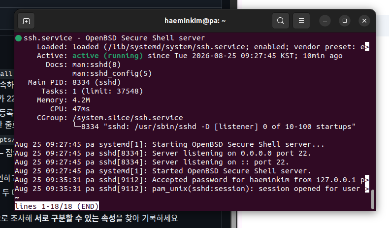
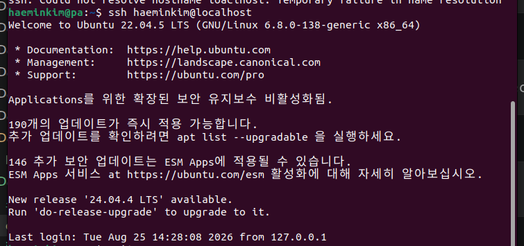
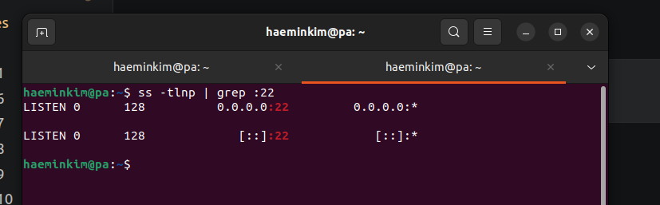
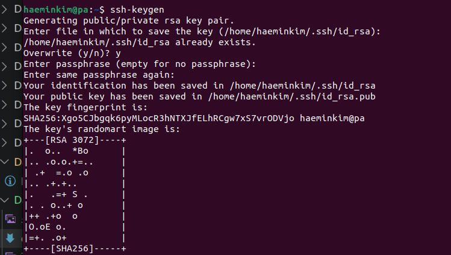
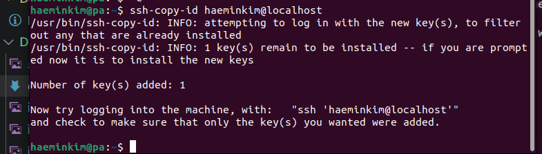
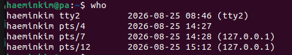
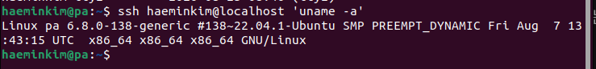
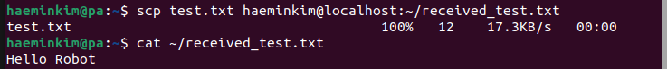

과제 1-2

## 시작 전 준비
1. SSH 설치
```
$ sudo apt install openssh-server
```
- 온보드 컴퓨터를 대신 접속할 대상을 만드는 것 
- 실제 로봇이 없을때 진행

<br>

2. 설치 확인
```
$ sudo systemctl status ssh
```

- active (running)이라고 나오면 정상

<br>

## SSH 접속

3. SSH 접속 연습
```
$ ssh haeminkim@localhost
```
- 내 컴퓨터가 자신 컴퓨터로 진행 하는 것 


3-1. 만약 다른 로봇이 있다면 
```
$ ssh haeminkim@192.168.X.X
```
- 이런 IP주소가 있는 곳으로 접속
- 같은 WIFI여야 함.

<br>

## 실행 확인

4. SSH 서버가 실행 중인지 확인
```
$ systemctl status ssh
```

- 이런 상태가 나올 예정

<br>

5. SSH가 22번 포트를 열어놓고 기다리는지 확인
```
ss -tlnp | grep :22
```
- -tlnp는 현재 컴퓨터에서 열려있는 네트워크 포트들을 확인
- | 는 앞의 결과를 다음 명령으로 전달
- grep :22는 그중 ":22"가 있는 줄만 찾아달라는 명령
- 22이인 이유는 기본적으로 SSH가 사용하는 포트 번호이기때문

- 보면 'LISTEN'이라는 것은 SSH 서버가 22번 문을 열어놓고 다른 컴퓨터가 접속하기를 기다리고 있다는 뜻.


## 키 생성

6. SSH 키 만들기
```
$ ssh-keygen
```
- 다음으로 Enter file in which to save the key 문의 나올때 --> enter키
- Enter passphrase (empty for no passphrase): --> enter키
- Enter same passphrase again: --> 키
- 위와 같이 진행 했을때 아래 사진과 같이

```
Your identification has been saved in /home/haeminkim/.ssh/id_rsa
Your public key has been saved in /home/haeminkim/.ssh/id_rsa.pub
```
라는 문구가 나올거다. 
- /id_rsa는 개인키 - 절대 남에게 주지 않음
- /id_rsa.pub는 공개키임을 뜻함. - 서버에 등록해도 됨.
- 둘다 본인 증명을 거쳐야 하는 것.
- 실제로는 `~/.ssh/authorized_keys`에 등록됨. 

7. 공개키를 SSH 서버에 등록
```
$ ssh-copy-id haeminkim@localhost
```
- 공개키를 등록하는 명령어
```
Are you sure you want to continue connecting (yes/no)?
```
- 이런 질문이 나왔을 때 
```
yes
```
로 답하고 진행


- 키 입력을 완성했다는 메세지가 뜸

8. 진짜 비밀번호 없이 되는지 확인
```
$ ssh haeminkim@localhost
```


- 결과 사진
- 접속한 SSH 세션에서 다시 원래 터미널로 나오려면 
```
exit
```

## 접속 확인
9. who 상태 확인



```
haeminkim   pts/12   2026-08-25 15:12   (127.0.0.1)
    ↑          ↑            ↑                ↑
 사용자      원격 터미널    접속 시간       접속한 곳 
```
아래 의미는
```
haeminkim tty2
```
- Ubuntu에 직접 로그인해서 사용하는 로컬 터미널 세션이라는 뜻

<br>

10. 접속하지 않고 원격 명령 실행하기
```
$ ssh haeminkim@localhost 'uname -a'
```
- uname -a는 그 컴픁의 Linux/커널 등의 시스템 정보를 보여주는 것.
- SSH 서버 안에 계속 머무는 것이 아닌 원래 터미널로 바로 돌아오는 것.
- 로봇에도 유용한 이유: 로봇 컴츄터에 직접 들어가지 않고 상태 확인 명령 하나만 실행.


<br>

## 원격 조정

11. scp로 파일 전송하기
테스트 파일을 만들고 
```
$ echo "Hello Robot" > test.txt
```
실존을 확인한다
```
$ cat test.txt
```

- Hello Robot의 존재 여부를 확인할 수 있음

<br>

12. localhost로 실습하고 있으니 혼선을 피해 다른 이름으로 서버 쪽에 복사
```
$ scp test.txt haeminkim@localhost:~/received_test.txt
```
의미는
```
scp  test.txt  haeminkim@localhost:~/received_test.txt
 ↑       ↑              ↑
명령    보낼 파일        보낼 목적지
```

- recieved_file.txt에 "Hello Robot"이라는 내용이 존재함을 확인할 수 있음. 


## 가상 라이다 / IMU 추가
13. 작업폴더 만들기
```
$ mkdir -p ~/fake_sensors && cd ~/fake_sensors
```

14. 가짜 센서 만들기
```
$ truncate -s 10M lidar.img imu.img
```
의미는
```
fake_sensors/
├── lidar.img    ← 10MB
└── imu.img      ← 10MB
```
- 10 megabyte짜리 두개 파일 생성 

15. lidar.img를 loop 장치에 연결
```
$ sudo losetup -f --show lidar.img
```
- -f는 현재 비어 있는 loop 장치를 알아서 찾아라 라는 의미
- --show는 어떤 장치에 연결했는지ㅣ 화면에 보여달란 의미

출력 결과:
```
/dev/loop20
```

16. IMU도 똑같이 연결
```
$ sudo losetup -f --show imu.img
```
결과:
```
/dev/loop21
```
즉
```
lidar.img ───▶ /dev/loop20
imu.img   ───▶ /dev/loop21
```

16-1. 해제시
```
$ sudo losetup -d /dev/loop20 /dev/loop21
```
- 반듯이 추가된 loop번호를 기억하거나 확인하고 입력.
- 틀리면 다른데서 사용하고 있는 것을 해제하게 될 수도 있음.


## 구분 할 수 있는 속성 찾기

17. 각 udev를 확인했을때 라이다와 IMU를 구별 할 수 있는, 즉 서로 다른 값을 찾아라

라이다
```
 KERNEL=="loop20"
 ATTR{diskseq}=="45"
 ATTR{stat}=="      79        0     1372        1        0        0        0        0        0        1        1        0        0        0        0        0        0"
```

IMU
```
KERNEL=="loop21"
ATTR{diskseq}=="47"
ATTR{stat}=="      68        0     1344        0        0        0        0        0        0        0        0        0        0        0        0        0        0"
```

## udev 규칙 작성
장치가 발견되면 앞으로 고정 이름으로 인식이 되게끔 하는 것. 그 규칙을 새겨주는 것.

이 절차를 밟지 않으면 추후에 일어날 수 있는 일:
```
지금
LiDAR → /dev/loop20
IMU   → /dev/loop21

나중에
LiDAR → /dev/loop23
IMU   → /dev/loop24
```
- 이러면 프로그램이 라이다가 몇번이었는지 혼동할 수 있음.

18. 

DISKSEQ="는 영구적으로 식별하는 값이 아님. 
XVXㅇㅀㅇㅎㅇ