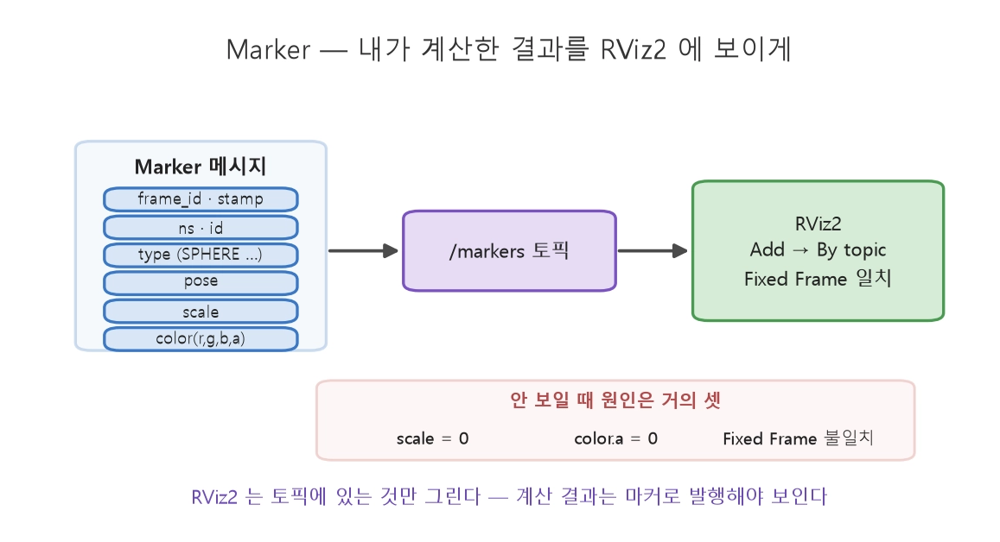
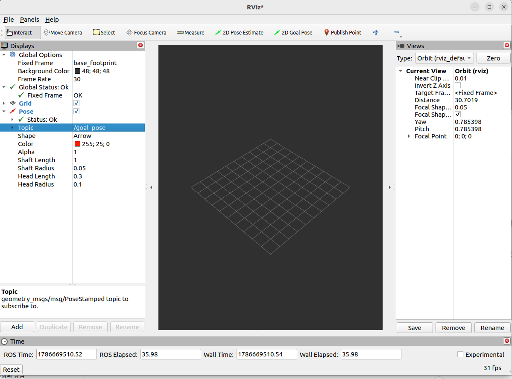
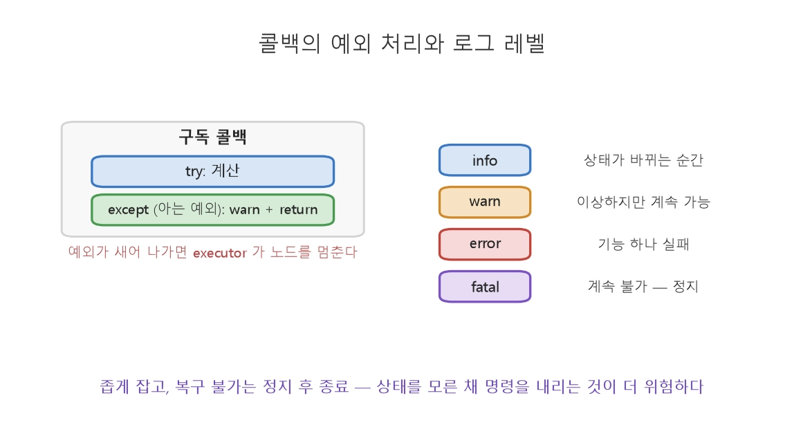

date:2026 Aug 14, Friday


## 1. 디버깅 도구 상자 - 목적별로 고르기
문제 구별에 따라 디버깅 진단 도구


<br>

토픽 존재·내용·주파수·QoS
```bash
$ ros2 topic list / echo / hz / info 
```
<br>

노드와 그 연결
```bash
$ ros2 node list / info                 
```
<br>

직접 메시지 주입해 테스트
```bash
$ ros2 topic pub ... 
```
<br>

노드-토픽 연결 시각화
```bash
$ rqt_graph                             
```
<br>

"무엇이 궁금한가"에 따라 도구를 고르는 것이 **Debugging** 입니다. 

<br>

## 2. Rviz2 - 로봇의 눈으로 3D 보기
RVIZ2 - ROS2의 대표 3D 시각화 도구. 추상적인 숫자 토픽을 공간 속 형상으로 표현.여러 정보를 하나의 공간에 겹쳐 볼 수 있는 강력한 도구.

- 센서데이터: LiDAR 점군, 카메라 영상, 깊이 데이터를 3D 공간에 표시
- TF 좌표계: frame tree를 3D 축으로 - 각 좌표계가 로봇과 함께 움직이는 것을 시각화
- 로봇 모델: 로봇의 형상(URDF)을 실제 자세로 렌더링
- 경로·마커: 계획된 경로, 감지된 장애물을 시각적으로



<br>

1. RViz 먼저 실행
```bash
$ rviz2
```
 <br>

2. Gazebo 실행
```bash
$ ros2 launch turtlebot3_bringup rviz2.launch.py
```

 <br>

3. turtlebot 실행
```bash
$ ros2 launch turtlebot3_gazebo turtlebot3_world.launch.py
```
or (위 코드가 안돼면)
```bash
$ ros2 launch turtlebot3_gazebo empty_world.launch.py
```

 <br>
 
4. 입력 키창 띄우기
```bash
$ ros2 run turtlebot3_teleop teleop_keyboard
```
- 입력해보기

창이 띄워지면 몇가지 옵션을 바꿔서 볼 수 있는 시점들 알맞게 고르기

- Fixed Frame : base_footprint
    - map에서 base_footprint로 전환 후 enter
    - 인식이 되는 옵션을 선택해야 확인 가능
- Add -> Pose : /goal_pose 
    - 알맞는 Topic을 선택해야 볼 수 있음. 
- Marker.SPHERE_LIST or MarkerArray - 여러 점을 한번에 그리고싶을 때


!! ***빨간 표시가 뜨면 알만는 옵션을 재선택해서 확인해보기*** !!


### 내 계산한 결과 보기
RViz2는 Topic에 있는 것만 그린다.
<br> "내가 계산한 결과"를 보려면 그것을 Marker Topic으로 발행해야 함. 
<br> 표준 타입 - 'visualization_msgs/Marker'

```python
from visualization_msgs.msg import Marker

m = Marker()
m.header.frame_id = 'world'                  # 어느 좌표계 기준인가(14강)
m.header.stamp = self.get_clock().now().to_msg()
m.ns, m.id = 'waypoints', 0                  # 같은 ns+id 는 덮어쓰기, 다르면 따로 그림
m.type = Marker.SPHERE                       # SPHERE·CUBE·ARROW·LINE_STRIP·TEXT_VIEW_FACING
m.action = Marker.ADD
m.pose.position.x, m.pose.position.y = 2.0, 3.0
m.pose.orientation.w = 1.0                   # 회전 없음
m.scale.x = m.scale.y = m.scale.z = 0.2      # 크기 [m] — 0 이면 안 보인다
m.color.r, m.color.a = 1.0, 1.0              # a(알파) 0 이면 투명해서 안 보인다
self.marker_pub.publish(m)
```
<br>

### Robotics
- Marker 메세지에 계산 결과를 담아 Topic으로 발행하고, RViz2 에서 그 토픽을 추가하면 화면에 뜹니다.  
- 여러 정보를 하나의 공간에 겹쳐 볼 수 있는 강력한 도구
- "LiDAR가 본 장애물" & "인지가 검출한 장애물" & "TF상 센서 위치"를 한 화면에 겹쳐보고 좌표 일치성을 확인한다. 
- TF debugging에서 RViz2는 필수.

### 문제 
위와 같은 절차를 진행해도 화면에 아무 것도 안나온다면 원인은 대개
<br> **scale 0 · alpha 0 (color.a = 0) · Fixed Frame** 불일치 셋 중에 하나입니다. 

<br>

## 3. rosbag2 - 기록하고 재생하기
디버깅의 어려움인 재현을 기록하고 재생해보는 과정
- timestamp
- replay

1. 녹화를 시작해본다.
```bash
$ ros2 bag record /scan /image /tf
```
녹화 중인 터미널에서:

• Space : 일시정지(Pause).
• Space 다시 : 녹화 재개(Resume).
• Ctrl+C : 녹화 종료 및 bag 저장 완료.

2. 전체를 이름붙여 기록한다
```bash
$ ros2 bag record -a -o field_test_01
```

3. 재생
```bash
$ ros2 bag play field_test_01   
```

4. 내용 요약
```bash
$ ros2 bag info field_test_01
```
- 토픽/기간/메세지 수


### Robotics 
**data set 구축** - Ai 학습용 로봇 데이터
<br> **호귀 테스트** - 같은 입력에 알고리즘이 여전히 잘 작동하는지

<br>

***"현장에서 한번 기록, 책상에서 무한 재생"***

<br>

## 3. rosbag2 - 기록하고 재생하기


## 4. 예외 처리와 로깅 - 노드가 죽지 않게

예외 처리 of 콜백
<br> 로그 레벨



콜백 - 실패할 수 있는 계산 

