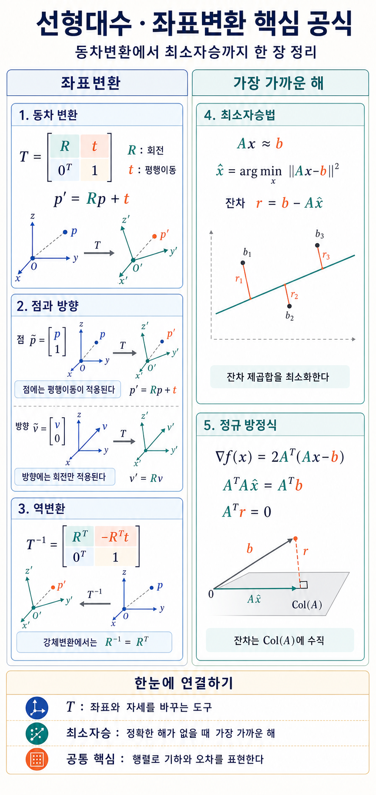

Date: 2026 Sept 2, Wednesday



<<외우기>>

#### 동차변환

```math
T = \begin{bmatrix} R & t \\ 0 & 1 \end{bmatrix}
```

<br>

#### 점

```math
\begin{bmatrix} P \\ 1 \end{bmatrix}
```

<br>

#### 방향

```math
\begin{bmatrix} v \\ 0 \end{bmatrix}
```

<br>

#### 역변환

```math
T = \begin{bmatrix} R^{T} & -R^{T}t \\ 0 & 1 \end{bmatrix}
```

<br>

#### 최소자승법

```math
\underset{x}{\mathrm{mix}} \space ||Ax - b ||^2
```

<br>

#### 정규방적식
```math
A^T A_x = A^T b
```

