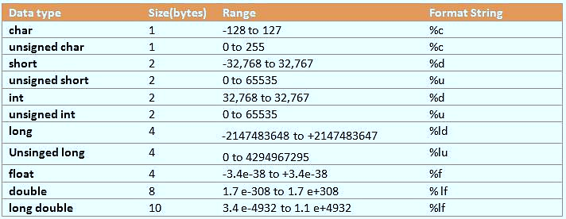

Date:2026-08-11, Tuesday

## Review
8강에서의 스마트 포인트 예시 파일:
[hello_world.cpp](TeachersGuide/hello_world.cpp)

data누적을 막을 수 있는 길이 스마트 포인터다 
예) LiDAR, IMU 센서 데이타가 누적되는 경우가 흔하다

 

## To Do
5,6,7,8강의는 코드들을 눈에 익히기만 하는 습관을 들였으면 좋겠다

문법만 참고하도록

오늘의 과제:

복습, 본인이 직접 만든 코딩(C++) github에 올리기.

 

## Today

### 9강.# ROS2 노드와 실행 모델 (콜백·executor·spin·멀티스레딩)

[text](../../../../../../..)

#### 구독 예시
모터 드라이버 
해상도를 변경해야 할때 구독한다 - 하지만 실시간으로 적용시키진 않아서 흔하진 않다
자율주행에서는 모든 센서를 구독한다. 
'Subscribe'

#### 발행
앵코더 센서
모터의 응도 
속도
카메라 이미지 데이타
'Publisher'

#### 이벤트
예) 스톱, 알람, 자리매김, 달리기 등

ros2안에서 통시이 이 모든 발행과 구독이 자동으로 되어서 편하다

콜백: 이벤트가 일어났을때 정상적인 데이타가 올때마다 이벤트를 실행 시긴다

URDF
TF library 라고 로봇의 조인트가 기준점을 기준으로 어느 위치로 뻗어야 하는지 자동으로 계산한다

ROS2버전이 아주 많지만 우리는 humble 버전을 사용한다
- 안정화가 충분히 됨.

jazzy는 나온지 얼마 안나와서 지원되는 프로그램이 많이 없다

#### DDS
Data Distribution Service
통신이나 데이터를 관리할때 외부에서 관리한다.
두가지 로봇을 같은 IP내에서 빠르게 통신하는  방법이므로 
ROS2가 이걸 가능하게 한다.
한 WIFI로 모두 공유하기에는 벅찰 수 있으니 
DDS가 특정 주기를 관리를 할 수 있고 
DDS의 사용은 아주 오래됐지만 ROS2는 최신이라고 볼 수 있다
라디오 주파수를 전환해 인터넷으로 사용도 가능
프랑스에서 로봇으로 통신할 수 있었던 기능도 위와같은 기능을 사용함 - 대신 느림
우리는 cyclone DDS를 사용할 것 같다

node라는 프로세스가 있고 
분리가 더 편하다. 모터 드라이브가 하나가 죽는다고 나머지 프로세스가 죽지 않고 
로봇의 팔 하나하나에 노드 하나씩 부여가 가능
ros1도 같은 방식이었지만 좀더 안정되고 통신이 보완된거라고 보면 된다
아직은 ros2의 단점이 발견이 되지 않아서 다음 버전이 언제 나오리라고는 예상하기가 어렵다.

원래의 노드 패키지는 이미 있지만 실행만 하는 것
crazy_real.launch.py 참조 
bringup.launch.py
motor_driver_node.cpp

Topic
발행하는 노드, 구독하는 노드 별개
발행하는 노드가 발행하는 노드에게 구독당할 수 없음
Topic의 양식이 정해져있음
예) odometry, JointState, Float32, 
발행/구동이 있어야 토픽이라는 것이 생긴다

파이썬은 마스터 프로세스 실행시키는 키로 생각한다면 
.cpp는 그 행정에 대한 값들의 발행 구독이 된다. 

/scan, /obstacles, /image 등의 코드가 있어야 인식을 한다. 

## 실습 for FUN!!!

[turtleBot 시뮬레이션](TurtleBot/turtleBot.md)

