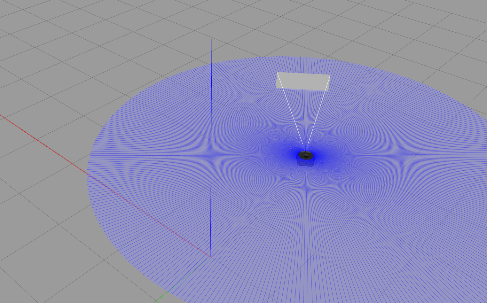
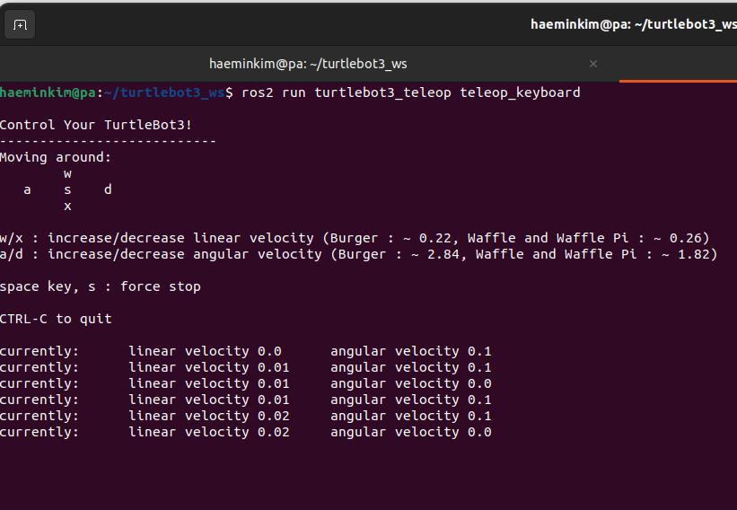
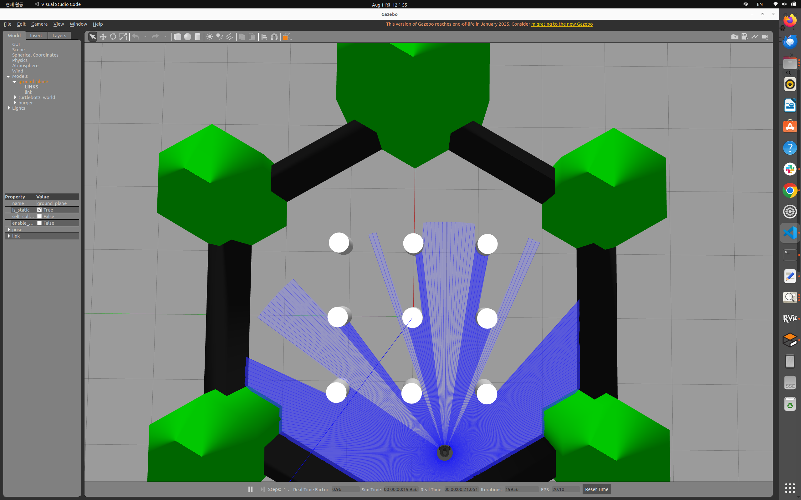
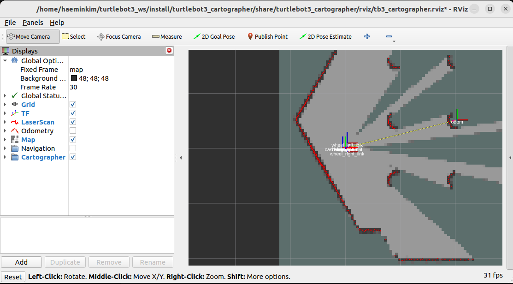
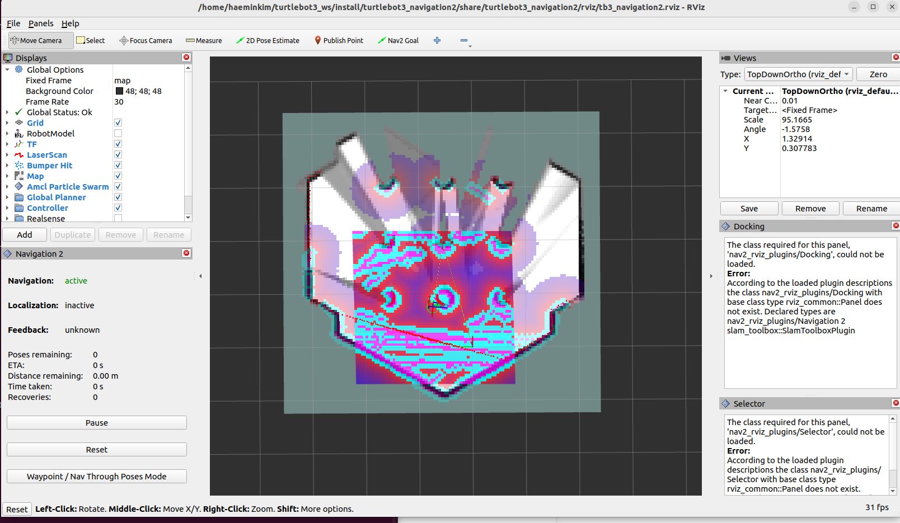
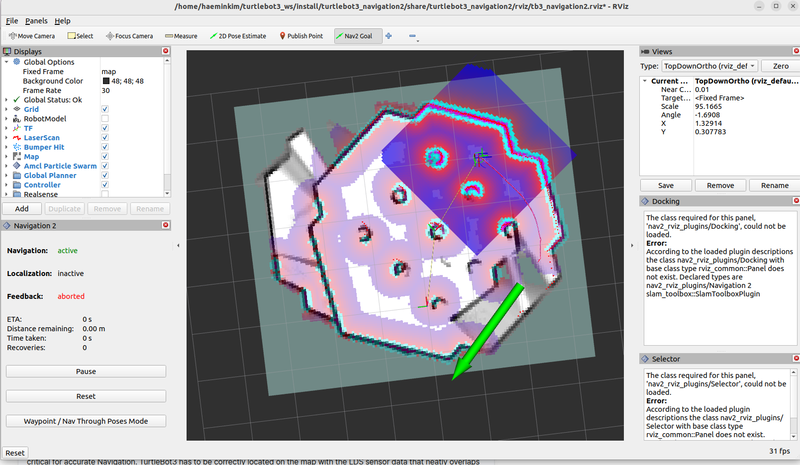

## 실습 for FUN!!!

turtlebot을 실험해 볼 수 있는 gazebo파일을 다운받아 매핑을 해본다. 


1. 아래 웹사이트 주소로 이동

웹사이트 주소:
https://docs.robotis.com/docs/systems/turtlebot3/quick_start_guide/pc_setup/

2. pc setup 진행하기
- 터미널 창을열고 아래 코드 입력하기.
- 가재보 프로그램 설치
```bash
$ sudo apt install ros-humble-gazebo-*
```
* 진행 후 'turtlebot3_ws' 파일이 홈에 가보면 생성되어 있을것이다. 
* 클린 빌드는 안에 있는 build, install, log 파일만 지우고 다시 설치해야 할것이다. 
* 가끔 노드가 없다, 또는 안된다는 문제가 발생할 때 보통 이 노드들이 설치가 잘 안됐을 경우를 이야기하는 것일거다. 

- 그 다음 코드들을 실행한다
- Install Cartographer
```bash
$ sudo apt install ros-humble-cartographer
$ sudo apt install ros-humble-cartographer-ros
```
- Install Navigation2
```bash
$ sudo apt install ros-humble-navigation2
$ sudo apt install ros-humble-nav2-bringup
```

- Install the required TurtleBot3 Packages
```bash
$ source /opt/ros/humble/setup.bash
$ mkdir -p ~/turtlebot3_ws/src
$ cd ~/turtlebot3_ws/src/
$ git clone -b humble https://github.com/ROBOTIS-GIT/DynamixelSDK.git
$ git clone -b humble https://github.com/ROBOTIS-GIT/turtlebot3_msgs.git
$ git clone -b humble https://github.com/ROBOTIS-GIT/turtlebot3.git
$ sudo apt install python3-colcon-common-extensions
$ cd ~/turtlebot3_ws
$ colcon build --symlink-install
$ echo 'source ~/turtlebot3_ws/install/setup.bash' >> ~/.bashrc
$ source ~/.bashrc
```

- Environment Configuration
```bash
$ echo 'export ROS_DOMAIN_ID=30 #TURTLEBOT3' >> ~/.bashrc
$ echo 'source /usr/share/gazebo/setup.sh' >> ~/.bashrc
$ echo 'source /opt/ros/humble/setup.bash' >> ~/.bashrc
$ source ~/.bashrc
```
- 여기서 아래 코드를 실행하고 열어서 아이디 넘버를 내 사물함 번호로 매긴다
```bash
nano ~/.bashrc
```

<br>

3.시뮬레이션 셋업
simulation > gazebo를 웹사이트 항목에서 선택해서 

실행창에 아래의 코드를 실행한다
```bash
$ cd ~/turtlebot3_ws/src/
$ git clone -b humble https://github.com/ROBOTIS-GIT/turtlebot3_simulations.git
$ cd ~/turtlebot3_ws && colcon build --symlink-install
```

- 아래 코드를 각각 실행한다.
```bash
echo 'export TURTLEBOT3_MODEL=waffle_pi' >> ~/.bashrc
```
```bash
source ~/.bashrc
```
마지막 코드를 실행했을때 나타나는 이 창에서는 맨밑 하단까지 
스크롤을 끝까지 하면 아이디를 바꾸는 란이 있다. 
 ```bash
 export ROS_DOMAIN_ID=30 #TURTLEBOT3
 ```
 라고 쓰여있는 란의 '30'을 '27'(당시 개인 사물함 번호)로 바꾼다.
 이유: 위와 같은 번호 조정을 하는 이유는 학생 모두가 고유 아이디 번호가 같아서 
 개별 아이디를 부여한 것이다.
 이러면 개별 로봇이 발행하는 정보를 정확히 구독할 수 있도록 유도한다. 

- 아래 두가지 파일을 각각 새로운 창으로 실행을 하면 
```bash
ros2 launch turtlebot3_gazebo empty_world.launch.py
```
```bash
ros2 run turtlebot3_teleop teleop_keyboard
```



키보드 창에서는 이동을 진행하려면 
a(좌회) w(전진) d(우회) s(멈춤) 키를 누르며 행동을 관찰할 수 있다. 
* 회전 키를 한번씩 누르면 가속이 빨라지고 
* 전진은 꽤나 느리게 가속화 된다. 

행동창을 닫기 위해선 우선 실행 멈춤을 해야 하는데 
그러려면 
ctrl + c 를 해당창에서 누르면 된다. 

5. Navigation & Mapping

- 아래 창을 새로운 창에 실행하면
```bash
$ export TURTLEBOT3_MODEL=burger
$ ros2 launch turtlebot3_gazebo turtlebot3_world.launch.py
```

위와 같은 platform이 나타나고

- 아래 창을 실행하면 
```bash
$ export TURTLEBOT3_MODEL=burger
$ ros2 launch turtlebot3_cartographer cartographer.launch.py use_sim_time:=True
```

위와 같은 mapping 현황을 볼 수 있는 창이 뜬다

그러면 키보드 창에서 이동을 여러번 
진행하여서 현 위치를 파악 시키고 

- 아래를 새로운 창에 실행하면 홈 위치에 파일이 두개 생긴다
```bash
ros2 run nav2_map_server map_saver_cli -f ~/map
```
하나는 파악이 완료된 맵의 사진이고


둘째는 위치 정보에 대한 것을 저장한 위치 관련 파일이 저장된다
[text](TurtleBot/map.yaml)
* 해당 파일에서는 나중에 임의로 위치나 해상도를 조정할 수 있다. 

- 아래와 같은 명령을 개별 창에 띄우면
```bash
$ export TURTLEBOT3_MODEL=burger
$ ros2 launch turtlebot3_navigation2 navigation2.launch.py use_sim_time:=True map:=$HOME/map.yaml
```

아래 사진과 같이 네비게이션을 시킬 수 있는 창이 뜬다


아래 사진에 보면 네비게이션 벡터를 그려주는게 있는데,
벡터를 지적해주면 자동으로 그 방향으로 향하게 길을 만든다
그 길을 다니면 다닐수록 map을 완성해간다.
