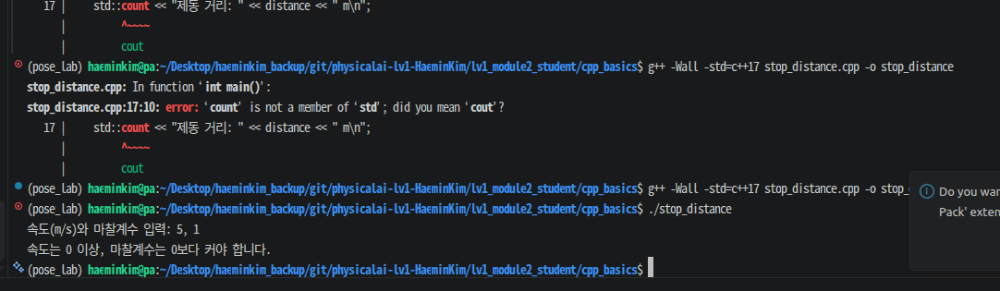
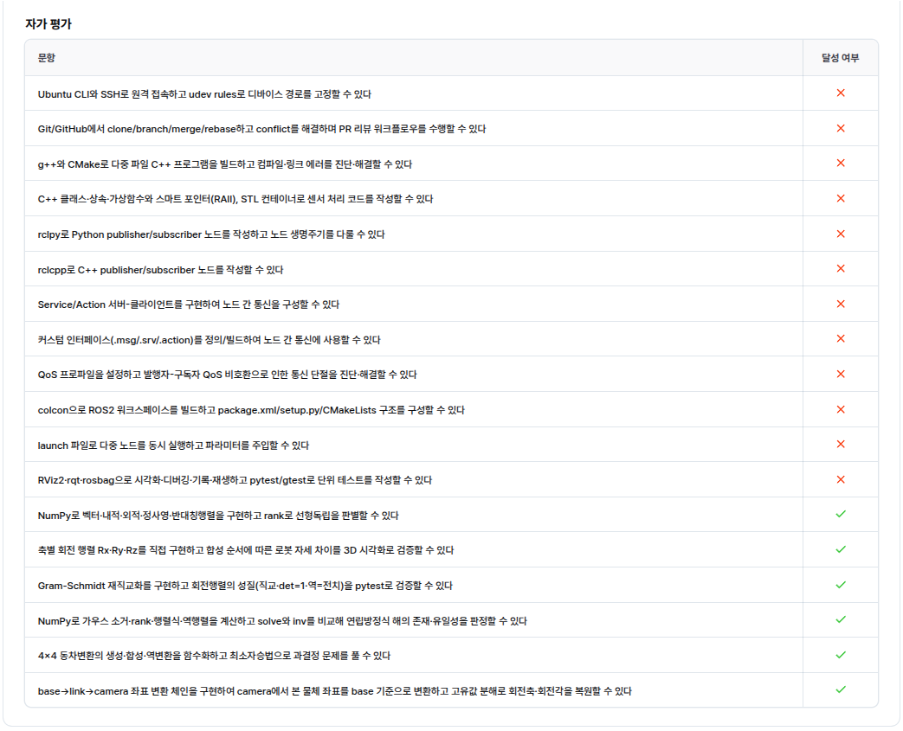

Date 2026 Sept 8, Monday

# Module 2

## 1. C++ 빌드 체계 세우기 - g++ 다중 파일 빌드와 CMake 전환

네. 아까 모듈 2의 **1번: C++ 빌드 체계 세우기**를 같이 시작하던 내용이에요.

진행 순서는 다음과 같습니다.

1. `stop_distance.cpp` 작성 → 단일 파일 빌드
2. `Motor` 클래스를 `motor.hpp`, `motor.cpp`, `main.cpp`로 분리 → 컴파일·링크 따로 실행
3. `motor.o`를 빼고 링크 → `undefined reference` 확인
4. CMake로 빌드 → `motor.cpp` 수정 후 증분 빌드 확인
5. 실행 명령·출력·설명을 `report.md`에 기록

우선 **1단계 제동 거리 계산**부터 안내했어요. 기존에 작성한 파일이 있다면 덮어쓰지 말고 그 파일에서 이어가면 됩니다.

`cpp_basics/stop_distance.cpp`:

```cpp
#include <iostream>

int main()
{
    double speed;
    double friction;

    std::cout << "속도(m/s)와 마찰계수 입력: ";
    if (!(std::cin >> speed >> friction) ||
        speed < 0.0 || friction <= 0.0) {
        std::cerr << "속도는 0 이상, 마찰계수는 0보다 커야 합니다.\n";
        return 1;
    }

    constexpr double gravity = 9.81;
    const double distance =
        speed * speed / (2.0 * friction * gravity);

    std::cout << "제동 거리: " << distance << " m\n";
    return 0;
}
```

평지에서 일정한 마찰로 정지한다고 가정한 공식 **\(d = v^2 / (2\mu g)\)**를 사용합니다. 속도 단위는 m/s예요.

`cpp_basics` 폴더에서 빌드하고 실행합니다.

```bash
g++ -Wall -std=c++17 stop_distance.cpp -o stop_distance
./stop_distance
```

- `-Wall`: 일반적인 경고 활성화
- `-std=c++17`: C++17 사용
- `-o stop_distance`: 실행 파일 이름 지정

입력으로 `10 0.5`를 넣으면 제동 거리가 약 `10.19 m` 나와야 합니다.

여기까지 확인한 다음, **Motor 클래스를 만들고 컴파일과 링크를 두 단계로 나누는 작업**으로 넘어가려던 참이었어요.

맞아요. 제가 코드부터 주고 설명을 건너뛰었어요. **각 코드의 의미 → 간단한 예시 → 과제에서 쓰는 방법** 순서로 같이 보겠습니다.

아까 제동 거리 코드를 위에서부터 풀어볼게요.

```cpp
#include <iostream>
```

화면에 출력하거나 키보드 입력을 받을 수 있도록 C++ 표준 라이브러리를 가져옵니다.

예를 들어:

```cpp
std::cout << "안녕하세요";
```

실행하면 화면에 `안녕하세요`가 나옵니다. `std::cout`은 화면 출력, `<<`는 출력할 내용을 전달하는 연산자입니다.

---

```cpp
int main()
{
    // 실행할 코드
}
```

`main`은 **프로그램 실행이 시작되는 함수**입니다. 중괄호 `{ }` 안의 코드를 순서대로 실행합니다.

앞의 `int`는 이 함수가 마지막에 정수를 반환한다는 뜻입니다. 보통 `return 0;`으로 정상 종료를 알립니다.

---

```cpp
double speed;
double friction;
```

소수까지 저장할 수 있는 `double` 타입의 변수 두 개를 선언합니다.

- `speed`: 속도를 저장할 공간
- `friction`: 마찰계수를 저장할 공간

예를 들어 값을 직접 넣으면:

```cpp
double speed = 10.0;
double friction = 0.5;
```

과제에서는 사용자가 입력하도록 만들기 때문에, 다음 코드에서 값을 채웁니다.

---

```cpp
std::cout << "속도(m/s)와 마찰계수 입력: ";
std::cin >> speed >> friction;
```

`std::cin`은 키보드 입력을 읽고, `>>`는 읽은 값을 변수에 넣습니다.

터미널에 다음처럼 입력하면:

```text
10 0.5
```

첫 번째 값 `10`은 `speed`, 두 번째 값 `0.5`는 `friction`에 들어갑니다. 공백이나 엔터로 값을 구분할 수 있어요.

---

원래 코드에서는 입력과 검사를 합쳐서 작성했습니다.

```cpp
if (!(std::cin >> speed >> friction) ||
    speed < 0.0 || friction <= 0.0) {
    std::cerr << "속도는 0 이상, 마찰계수는 0보다 커야 합니다.\n";
    return 1;
}
```

뜻은 **“입력이 잘못됐거나, 속도가 음수거나, 마찰계수가 0 이하라면 오류를 출력하고 종료하라”**입니다.

| 코드 | 의미 | 걸리는 입력 예시 |
|---|---|---|
| `!(std::cin >> speed >> friction)` | 숫자 두 개를 읽는 데 실패했는가? | `hello 0.5` |
| `speed < 0.0` | 속도가 음수인가? | `-10 0.5` |
| `friction <= 0.0` | 마찰계수가 0 이하인가? | `10 0` |
| `||` | 조건 중 하나라도 참이면 | 위 조건을 연결 |

`!`는 참과 거짓을 뒤집는 **NOT**, `||`는 **OR**입니다.

`std::cerr`는 오류 메시지를 출력할 때 사용합니다. `\n`은 줄바꿈이고, `return 1;`은 여기서 프로그램을 끝내면서 실패를 알리는 관례입니다.

마찰계수 `0`을 막는 이유는 아래 계산에서 **0으로 나누게 되기 때문**입니다.

---

```cpp
constexpr double gravity = 9.81;
```

중력가속도를 `gravity`라는 이름으로 정의합니다.

`constexpr`는 컴파일 시점에 값을 정할 수 있는 상수를 선언합니다. 실행 중 다른 값으로 바꿀 수 없습니다.

```cpp
gravity = 10.0;  // 컴파일 오류: 상수는 변경할 수 없음
```

계산식에 `9.81`을 직접 쓰는 것보다 `gravity`라고 쓰면 그 숫자의 의미가 분명해집니다.

---

```cpp
const double distance =
    speed * speed / (2.0 * friction * gravity);
```

제동 거리를 계산해 `distance`에 저장합니다.

공식은 다음과 같아요.

\[
d = \frac{v^2}{2\mu g}
\]

C++에서는 제곱을 여기처럼 곱셈으로 표현합니다.

```cpp
speed * speed
```

**`speed ^ 2`는 제곱이 아닙니다.** C++의 `^`는 다른 용도의 연산자예요.

입력이 `10 0.5`라면 계산은:

```text
10 × 10 ÷ (2 × 0.5 × 9.81)
= 100 ÷ 9.81
≈ 10.19 m
```

`const`는 계산해 저장한 `distance` 값을 이후에 변경하지 못하게 합니다. 여기서는 사용자 입력에 따라 실행 중에 계산하므로 `constexpr` 대신 `const`를 사용했어요.

---

```cpp
std::cout << "제동 거리: " << distance << " m\n";
```

문자열과 변수 값을 이어서 출력합니다.

```text
제동 거리: 10.1937 m
```

`"distance"`라고 따옴표를 붙이면 변수의 값이 아니라 글자 `distance`가 그대로 출력된다는 차이가 있습니다.

```cpp
std::cout << distance;    // 계산된 숫자 출력
std::cout << "distance";  // distance라는 글자 출력
```

---

```cpp
return 0;
```

프로그램이 정상적으로 끝났다는 상태를 운영체제에 전달합니다. **화면에 숫자 0을 출력하는 코드는 아닙니다.**

전체 흐름은 **입력받기 → 입력 검사 → 거리 계산 → 결과 출력 → 종료**입니다. 다음 `Motor` 클래스도 이런 식으로 코드의 의미와 작은 예시부터 보고 진행할게요.

---

input error



지금은 **`5, 1`처럼 쉼표를 넣어서** 입력 오류가 난 거예요. 숫자가 양수여도 입력 형식이 맞지 않으면 같은 오류 문구가 나옵니다.

```cpp
std::cin >> speed >> friction;
```

이 코드는 숫자 두 개를 **공백이나 엔터로 구분해서** 읽습니다.

- `5, 1` → `speed`에 `5`를 넣은 뒤, 남은 쉼표 `,` 때문에 두 번째 숫자를 읽지 못함
- `5 1` → `speed = 5`, `friction = 1`로 정상 입력

다시 실행해서 **쉼표 없이** 입력해 보세요.

```text
./stop_distance
속도(m/s)와 마찰계수 입력: 5 1
제동 거리: 1.27421 m
```

앞서 작성한 오류 문구가 숫자의 범위만 설명해서 헷갈릴 만해요. 이렇게 바꾸면 입력 형식 문제도 안내할 수 있습니다.

```cpp
std::cerr << "숫자 두 개를 공백으로 구분해 입력하세요. "
             "속도는 0 이상, 마찰계수는 0보다 커야 합니다.\n";
```

자가 평가..?


좋아요, 제동 거리 계산까지 성공했네요!

이제 **`Motor` 클래스를 세 파일로 나누는 단계**로 가봅시다. 먼저 각 파일의 역할부터 볼게요.

| 파일 | 역할 | 비유 |
|---|---|---|
| `motor.hpp` | 클래스가 가진 데이터와 기능을 선언 | 기능 설명서 |
| `motor.cpp` | 기능이 실제로 어떻게 동작하는지 구현 | 내부 장치 |
| `main.cpp` | `Motor`를 만들어 사용 | 사용자 |

먼저 **클래스는 객체를 만드는 설계도**라고 생각하면 됩니다. `Motor`라는 설계도로 모터 객체를 만들고, 각 모터에 속도를 저장할 거예요.

`cpp_basics` 안에 **`motor.hpp`**를 만들어 다음을 작성하세요.

```cpp
#pragma once

class Motor
{
public:
    void setSpeed(double speed);
    double getSpeed() const;

private:
    double speed_ = 0.0;
};
```

각 줄의 의미는 이렇습니다.

```cpp
#pragma once
```

하나의 소스 파일을 컴파일하는 동안 이 헤더가 여러 경로로 포함되더라도 **한 번만 처리**하도록 합니다. 클래스 중복 정의를 막기 위해 사용해요.

```cpp
class Motor
```

`Motor`라는 클래스, 즉 모터의 설계도를 정의합니다.

```cpp
public:
    void setSpeed(double speed);
    double getSpeed() const;
```

`public` 아래의 기능은 클래스 밖에서도 사용할 수 있어요.

- `setSpeed`: `double` 타입의 속도를 받아 저장할 함수입니다. `void`는 반환값이 없다는 뜻이에요.
- `getSpeed`: 저장된 속도를 `double`로 반환할 함수입니다. 뒤의 `const`는 이 함수가 객체의 일반 멤버 변수를 변경하지 않겠다는 뜻입니다.

여기에는 함수의 **선언만** 있습니다. 실제 동작을 담는 `{ ... }`는 다음 파일인 `motor.cpp`에 작성합니다.

```cpp
private:
    double speed_ = 0.0;
```

`private` 아래의 변수는 클래스 밖에서 직접 접근할 수 없습니다. 모터 속도의 초깃값은 `0.0`이고, 이름 끝의 `_`는 멤버 변수임을 알아보기 위한 작명 관례예요.

나중에 사용하는 모습은 이렇습니다.

```cpp
Motor motor;           // Motor 설계도로 객체 생성
motor.setSpeed(3.0);   // 공개된 함수를 통해 속도 설정
motor.getSpeed();      // 저장된 속도 3.0 반환
```

반면 다음은 컴파일 오류입니다.

```cpp
motor.speed_ = 3.0;    // private 변수에 외부에서 직접 접근
```

마지막으로 클래스 정의는 **`};`처럼 세미콜론으로 끝납니다.** 우선 이 헤더를 저장하면, 다음은 `motor.cpp`에서 두 함수의 실제 동작을 구현하는 단계예요.

이제 **`motor.cpp`에서 함수의 실제 동작을 작성**할 차례예요. `cpp_basics` 안에 `motor.cpp` 파일을 만들고 작성하세요.

```cpp
#include "motor.hpp"

void Motor::setSpeed(double speed)
{
    speed_ = speed;
}

double Motor::getSpeed() const
{
    return speed_;
}
```

각 부분을 살펴볼게요.

```cpp
#include "motor.hpp"
```

우리가 만든 헤더를 가져옵니다. 컴파일러가 `Motor` 클래스와 그 안의 함수·변수를 알 수 있게 해요.

- `<iostream>`: 표준 라이브러리 헤더
- `"motor.hpp"`: 직접 만든 헤더를 포함할 때 사용하는 형태

```cpp
void Motor::setSpeed(double speed)
{
    speed_ = speed;
}
```

**입력받은 속도를 모터의 멤버 변수에 저장**합니다.

- `void`: 반환값 없음
- `Motor::`: `Motor` 클래스에 속한 함수라는 뜻
- `setSpeed(double speed)`: 숫자를 하나 받아 `speed`라는 이름으로 사용
- `speed_ = speed;`: 오른쪽의 입력값을 왼쪽의 멤버 변수에 저장

예를 들어:

```cpp
motor.setSpeed(3.0);
```

이렇게 호출하면 함수 안에서는 다음과 같이 처리됩니다.

```cpp
speed_ = 3.0;
```

`speed`는 이번 호출에서 받은 값이고, `speed_`는 **객체 안에 저장되어 호출이 끝나도 유지되는 값**입니다.

```cpp
double Motor::getSpeed() const
{
    return speed_;
}
```

저장된 속도를 호출한 곳으로 돌려줍니다.

- `double`: 소수를 반환
- `Motor::getSpeed()`: `Motor`에 속하며 입력값이 없는 함수
- `const`: 객체의 상태를 바꾸지 않고 조회
- `return speed_;`: 저장된 속도를 반환

사용 예시는 다음과 같아요.

```cpp
motor.setSpeed(3.0);
double current = motor.getSpeed();  // current에 3.0 저장
```

**헤더의 선언과 구현의 함수 형태는 일치해야 합니다.** 그래서 `motor.hpp`에 쓴 `getSpeed() const`의 `const`를 여기에도 붙이는 거예요.

여기까지 저장하면, 다음에는 `main.cpp`에서 모터를 만들어 이 함수들을 호출하겠습니다.

이제 **`main.cpp`에서 모터 객체를 만들고 사용**해 볼게요. `cpp_basics` 안에 `main.cpp`를 만드세요.

```cpp
#include <iostream>
#include "motor.hpp"

int main()
{
    Motor motor;

    std::cout << "초기 속도: " << motor.getSpeed() << '\n';

    motor.setSpeed(3.0);

    std::cout << "변경 후 속도: " << motor.getSpeed() << '\n';

    return 0;
}
```

```cpp
#include <iostream>
#include "motor.hpp"
```

각각 화면 출력 기능과 우리가 정의한 `Motor` 클래스를 가져옵니다.

```cpp
Motor motor;
```

`Motor` 클래스로 **`motor`라는 객체**를 만듭니다.

```cpp
double speed;
Motor motor;
```

두 문장의 구조가 같아요. 앞은 **타입**, 뒤는 **변수 이름**입니다. `Motor`는 우리가 직접 만든 타입이고, 객체 안의 `speed_`는 헤더에서 정한 `0.0`으로 시작합니다.

```cpp
std::cout << "초기 속도: " << motor.getSpeed() << '\n';
```

`.`은 객체의 멤버에 접근할 때 사용합니다. `motor.getSpeed()`가 반환한 `0.0`을 화면에 출력해요. `'\n'`은 줄바꿈입니다.

```cpp
motor.setSpeed(3.0);
```

`motor`의 `setSpeed` 함수를 호출해 내부의 `speed_`를 `3.0`으로 바꿉니다.

이후 다시 `getSpeed()`를 호출하면 바뀐 값이 나옵니다.

```text
초기 속도: 0
변경 후 속도: 3
```

이제 세 파일을 모두 저장하고, 과제에서 요구한 **컴파일 → 링크 두 단계**로 빌드하겠습니다.

**① 컴파일: 각 `.cpp`를 `.o` 파일로 변환**

`cpp_basics` 터미널에서 실행하세요.

```bash
g++ -Wall -std=c++17 -c main.cpp -o main.o
g++ -Wall -std=c++17 -c motor.cpp -o motor.o
```

`-c`는 **컴파일까지만 하고 링크는 하지 말라**는 옵션입니다. 만들어지는 `.o`는 기계어 등이 담긴 *목적 파일*로, 아직 직접 실행할 프로그램은 아닙니다.

`motor.hpp`는 두 `.cpp`에서 포함하므로 별도로 컴파일하지 않습니다.

**② 링크: 목적 파일을 연결해 실행 파일 생성**

```bash
g++ main.o motor.o -o motor_demo
```

`main.o`에서 호출한 `Motor` 함수와 `motor.o`에 들어 있는 실제 구현을 연결합니다.

**③ 실행**

```bash
./motor_demo
```

위의 초기 속도와 변경 후 속도가 출력되면 성공이에요. 여기까지 확인한 다음, `motor.o`를 일부러 빼서 **링크 에러**를 만들어 보겠습니다.

이번에는 **`motor.o`를 일부러 빼고 링크해서 오류를 확인**해 볼게요. 파일을 삭제할 필요는 없습니다.

`cpp_basics`에서 실행하세요.

```bash
g++ main.o -o motor_demo_broken
```

다음과 비슷한 오류가 나올 거예요.

```text
undefined reference to `Motor::getSpeed() const'
undefined reference to `Motor::setSpeed(double)'
collect2: error: ld returned 1 exit status
```

이건 과제에서 요구한 **의도적인 링크 오류**입니다.

왜 생길까요? 우리가 작성한 코드를 연결해서 보면 이해하기 쉬워요.

```cpp
// motor.hpp: 이런 함수가 있다고 알려줌
void setSpeed(double speed);
```

```cpp
// main.cpp: 선언을 보고 함수를 사용
motor.setSpeed(3.0);
```

```cpp
// motor.cpp: 함수의 실제 동작을 정의
void Motor::setSpeed(double speed)
{
    speed_ = speed;
}
```

`main.cpp`를 **컴파일**할 때는 헤더의 선언으로 함수 이름과 입력 타입을 확인할 수 있어요. 따라서 `main.o`를 만드는 데는 문제가 없습니다.

하지만 **링크**할 때는 실제 함수 구현이 필요합니다. 그 구현이 담긴 `motor.o`를 빼면, 링커가 함수를 찾지 못해서 `undefined reference`를 출력해요.

| 구분 | 컴파일 오류 | 링크 오류 |
|---|---|---|
| 발생 단계 | `.cpp` → `.o` | `.o`들을 연결 → 실행 파일 |
| 원인 예시 | 문법 오류, 선언되지 않은 이름 | 사용한 함수의 구현을 찾지 못함 |
| 이번 작업의 예 | 앞서 작성한 `std::count` 오타 | `motor.o`를 빼고 링크 |

다시 정상적으로 연결하려면 두 목적 파일을 모두 넣으면 됩니다.

```bash
g++ main.o motor.o -o motor_demo
./motor_demo
```

**방금 실패한 명령과 실제 오류 출력을 복사해 두세요.** `report.md`의 문제 1에 넣을 자료입니다. 설명은 이렇게 정리할 수 있어요.

> `main.cpp`는 `motor.hpp`의 함수 선언을 참조하므로 컴파일에 성공한다. 하지만 링크 단계에서 `motor.o`를 제외하면 `Motor` 멤버 함수의 정의를 찾지 못해 `undefined reference`가 발생한다. 컴파일 오류는 소스의 문법·타입 등을 검사하는 과정에서, 이 링크 오류는 목적 파일들을 연결하는 과정에서 발생한다.

다음은 이 빌드 과정을 **CMake로 관리하는 단계**입니다.

지금 화면은 **정상적으로 다시 링크한 뒤 실행한 결과**예요!

입력한 명령에 `motor.o`가 포함되어 있죠.

```bash
g++ main.o motor.o -o motor_demo
```

그래서 정상 출력이 나온 겁니다.

```text
초기 속도: 0
변경 후 속도: 3
```

그리고 화면 맨 위의:

```text
collect2: error: ld returned 1 exit status
```

이 줄은 **앞서 링크 오류가 발생했다는 흔적**이에요. 터미널을 위로 스크롤하면 `undefined reference` 내용이 있을 가능성이 큽니다.

다시 오류를 확인하려면 **`motor.o`를 뺀 이 명령만** 실행하세요.

```bash
g++ main.o -o motor_demo_broken
```

이번에는 실행 명령을 이어서 입력할 필요 없이, 나온 오류 출력을 확인하면 됩니다.

맞아요. **의도적으로 발생시킨 실제 링크 오류**예요. 우리가 오류 문구를 출력한 게 아니라, 링커가 실제로 실행 파일을 만드는 데 실패한 겁니다.

화면에서 두 명령을 비교해 보세요.

```bash
g++ main.o -o motor_demo_broken
```

`motor.o`가 없어서 함수 구현을 찾지 못합니다. 그래서 실제 오류가 발생했어요.

```text
undefined reference to `Motor::getSpeed() const'
undefined reference to `Motor::setSpeed(double)'
```

반면:

```bash
g++ main.o motor.o -o motor_demo
```

필요한 구현을 모두 전달했으므로 성공합니다.

**“의도적”은 원인을 일부러 만들었다는 뜻이고, “실제 오류”인지와는 별개예요.** 실무에서 실수로 `motor.o`를 빠뜨려도 똑같은 오류가 납니다.

과제도 **“`motor.o`를 일부러 빼고 `undefined reference`를 재현하라”**고 했으니, 지금 정확하게 완료한 거예요. 이 실패 명령과 오류 출력을 보고서에 넣으면 됩니다.

**소스 코드에 문법이나 이름 오류를 넣고 컴파일하면 됩니다.** 아까 `std::cout`을 `std::count`로 썼을 때가 실제 컴파일 오류였어요.

이번에는 `main.cpp`에서 세미콜론 하나를 잠깐 빼보세요.

```cpp
motor.setSpeed(3.0);  // 원래 코드
```

이렇게 바꾸고 저장합니다.

```cpp
motor.setSpeed(3.0)   // 세미콜론 누락
```

그다음 **컴파일만** 실행하세요.

```bash
g++ -Wall -std=c++17 -c main.cpp -o main.o
```

다음과 비슷한 오류가 나옵니다. 정확한 표시 위치는 코드에 따라 달라질 수 있어요.

```text
error: expected ‘;’ before ‘std’
```

컴파일러가 “문장이 끝나야 하는데 `;`가 없다”고 알려주는 겁니다.

| 실험 | 실패 이유 | 실패 단계 |
|---|---|---|
| 세미콜론 `;` 누락 | 소스 문법이 잘못됨 | 컴파일 |
| `motor.o` 제외 | 호출한 함수의 구현을 찾지 못함 | 링크 |

**오류를 확인한 뒤에는 세미콜론을 복구하고 저장하세요.** 다시 같은 컴파일 명령을 실행했을 때 오류 없이 끝나면 정상입니다.

이제 **CMake로 빌드하는 단계**예요. 지금까지 직접 입력한 컴파일·링크 명령을 CMake가 생성하도록 만들겠습니다.

먼저 아까 뺀 세미콜론은 복구하고 저장해 주세요.

**1. `CMakeLists.txt` 만들기**

`cpp_basics` 안에 정확히 **`CMakeLists.txt`**라는 이름으로 파일을 만들고 작성하세요.

```cmake
cmake_minimum_required(VERSION 3.22)

project(CppBasics LANGUAGES CXX)

set(CMAKE_CXX_STANDARD 17)
set(CMAKE_CXX_STANDARD_REQUIRED ON)

add_compile_options(-Wall)

add_executable(stop_distance stop_distance.cpp)
add_executable(motor_demo main.cpp motor.cpp)
```

각 코드의 의미를 볼게요.

```cmake
cmake_minimum_required(VERSION 3.22)
```

이 프로젝트에 필요한 최소 CMake 버전을 지정합니다.

```cmake
project(CppBasics LANGUAGES CXX)
```

프로젝트 이름을 `CppBasics`로 정하고, C++를 사용한다고 알립니다. `CXX`가 C++를 뜻해요.

```cmake
set(CMAKE_CXX_STANDARD 17)
set(CMAKE_CXX_STANDARD_REQUIRED ON)
```

C++17을 사용하며, 해당 표준을 지원하지 않으면 낮은 표준으로 대신 빌드하지 않도록 합니다.

```cmake
add_compile_options(-Wall)
```

앞서 `g++`에 넣었던 `-Wall` 경고 옵션을 적용합니다.

```cmake
add_executable(stop_distance stop_distance.cpp)
```

`stop_distance.cpp`로 **`stop_distance` 실행 파일**을 만들라는 뜻입니다.

```cmake
add_executable(motor_demo main.cpp motor.cpp)
```

`main.cpp`와 `motor.cpp`를 각각 컴파일하고 연결해서 **`motor_demo` 실행 파일**을 만들라는 뜻이에요.

첫 번째 인수는 실행 파일 이름, 뒤는 필요한 소스 파일 목록입니다. `motor.hpp`는 소스에서 포함하므로 여기에는 별도로 적지 않아도 됩니다.

**2. 빌드하기**

현재 터미널이 `cpp_basics`에 있는 상태에서 실행하세요.

```bash
mkdir -p build
cd build
cmake -G "Unix Makefiles" ..
make
```

- `mkdir -p build`: 빌드 결과를 담을 폴더를 만듭니다.
- `cd build`: 그 폴더로 이동합니다.
- `cmake -G "Unix Makefiles" ..`: 상위 폴더(`..`)의 `CMakeLists.txt`를 읽어 `make`용 빌드 규칙을 만듭니다.
- `make`: 생성된 규칙에 따라 실제 컴파일과 링크를 수행합니다.

즉, **CMake가 빌드 규칙을 만들고, make가 그 규칙을 실행**합니다.

**3. 실행하기**

현재 위치인 `build`에서 실행하세요.

```bash
./motor_demo
```

예상 출력:

```text
초기 속도: 0
변경 후 속도: 3
```

여기까지의 **빌드 출력을 보고서용으로 남겨주세요.** 다음에는 `motor.cpp`만 수정하고 `make`를 다시 실행해서, 어떤 파일만 재컴파일되는지 확인하겠습니다.

이제 마지막으로 **`motor.cpp`만 수정했을 때 필요한 파일만 다시 빌드되는지** 확인해 볼게요. 이걸 **증분 빌드**라고 합니다.

**1. `motor.cpp` 수정**

`setSpeed`를 다음처럼 바꾸고 저장하세요.

```cpp
void Motor::setSpeed(double speed)
{
    speed_ = (speed < 0.0) ? 0.0 : speed;
}
```

`조건 ? 참일 때 값 : 거짓일 때 값`은 **삼항 연산자**입니다.

```cpp
(speed < 0.0) ? 0.0 : speed
```

뜻은 “속도가 음수면 `0.0`을, 아니면 입력값을 저장하라”예요. 다음 코드와 같은 동작입니다.

```cpp
if (speed < 0.0) {
    speed_ = 0.0;
} else {
    speed_ = speed;
}
```

예를 들어 `setSpeed(-2.0)`이면 `0.0`, `setSpeed(3.0)`이면 `3.0`이 저장됩니다.

**2. 현재 `build` 폴더에서 다시 빌드**

```bash
make
```

출력에서 다음 두 줄을 찾아보세요. 퍼센트는 달라질 수 있습니다.

```text
Building CXX object CMakeFiles/motor_demo.dir/motor.cpp.o
Linking CXX executable motor_demo
```

이번에는 **`motor.cpp`만 재컴파일하고, `motor_demo`를 다시 링크**해야 합니다. 수정하지 않은 `main.cpp`와 `stop_distance.cpp`의 컴파일 줄은 나오지 않아야 해요.

`Built target stop_distance`가 나오더라도 재컴파일했다는 뜻은 아닙니다. 해당 대상이 최신 상태로 준비됐다는 표시입니다.

**3. 왜 이렇게 판단할까요?**

이 Make 기반 빌드에서는 **파일의 수정 시각과 의존 관계**를 확인합니다.

- `motor.cpp`가 목적 파일보다 새로움 → `motor.cpp.o` 재생성
- 목적 파일이 바뀜 → 실행 파일 다시 링크
- 나머지 소스와 의존 파일은 그대로 → 기존 목적 파일 재사용

이때의 **실제 `make` 출력도 복사해 두세요.** 문제 1에서 요구하는 증분 빌드 증거입니다.

